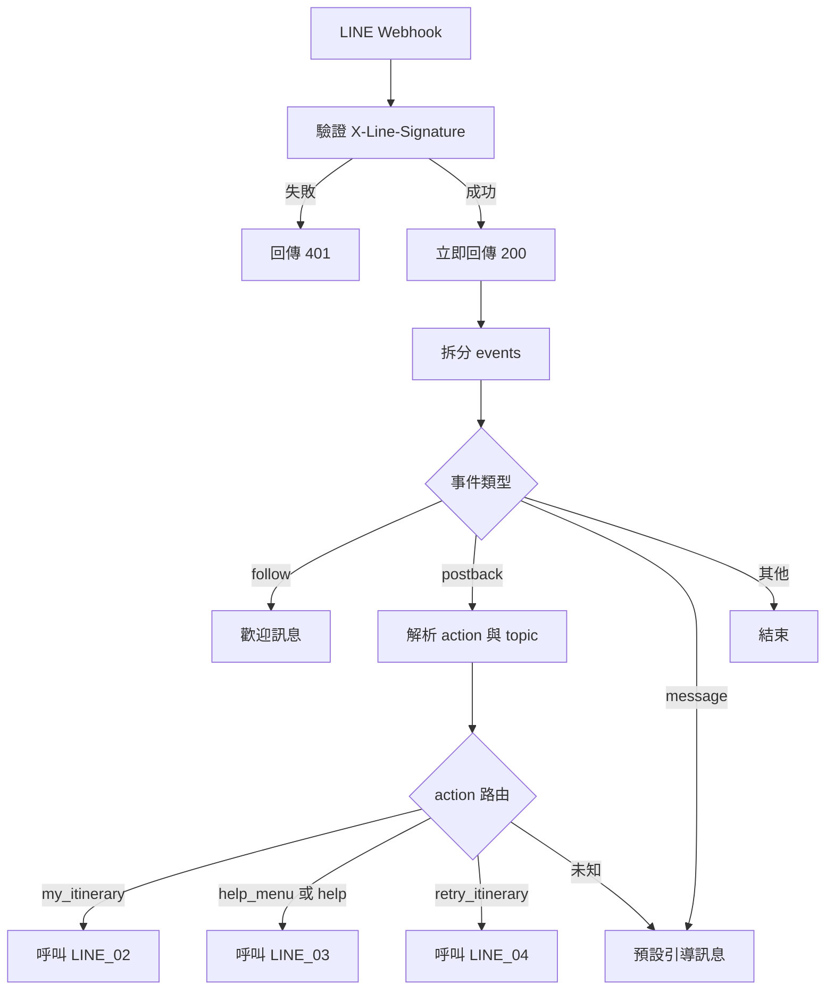
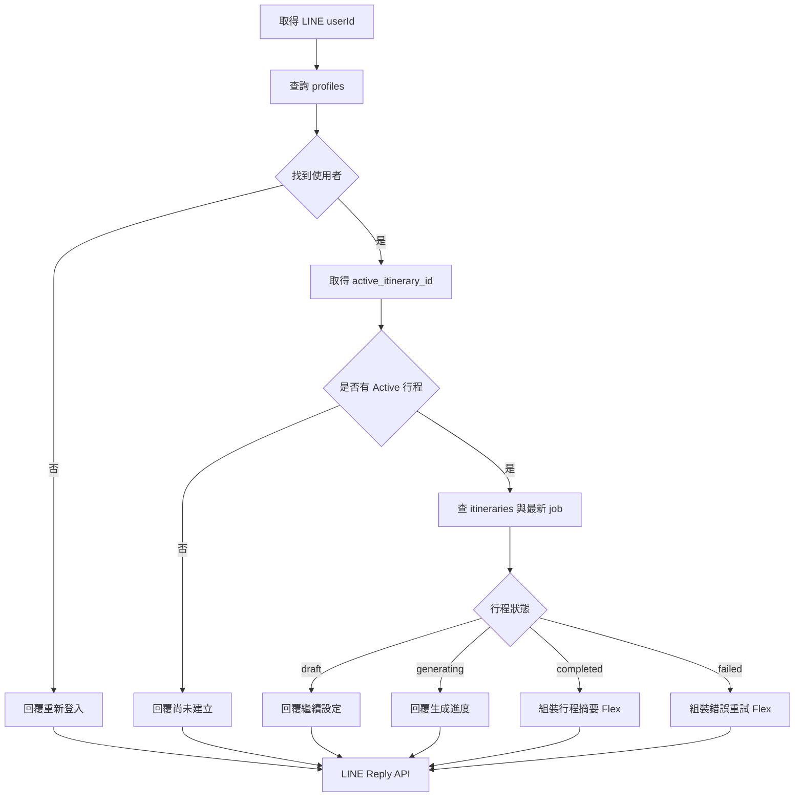
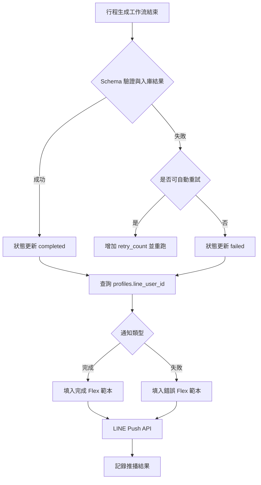

# TRACK3-01: LINE Bot Webhook、Active 行程回覆與 Flex Message 推播服務

* **工單編號**：TRACK3-01
* **所屬軌道**：Track 3 - 機票、數據與 LINE Bot 整合組
* **建議負責人**：1 人（數據／後端工程師）
* **優先級**：High (P1)
* **前置依賴 (Dependencies)**：`TRACK0-04`、`TRACK1-01`、`TRACK1-02`、`TRACK2-01`、`TRACK2-06`
* **狀態**：ready-for-agent

---

## 0. 開工前確認檢查清單 (Pre-Execution Sign-off / 執行者自檢)
> ⚠️ **執行者開工前必讀・問詢門檻**：動工前請確認以下項目皆已就緒並手動勾選，未確認前置產出前切勿盲目施工：
- [ ] **硬性前置實體產出確認**：已取得 LINE Official Account、Messaging API Channel Secret、Channel Access Token、LIFF ID 與可用測試帳號。
- [ ] **視覺範本確認**：已取得 TRACK0-04 的 `richmenu_bounds.json`、`flex_message_itinerary_ready.json` 與 `flex_message_error_retry.json`。
- [ ] **資料契約確認**：已理解 `profiles.line_user_id`、`profiles.active_itinerary_id`、`itineraries.status`、`itinerary_jobs.status` 與 `itinerary_data` 的實際結構。
- [ ] **LINE API 規則確認**：清楚 Reply API 使用一次性 `replyToken`；背景生成完成、失敗與 PDF 完成通知必須使用 Push API。
- [ ] **安全紅線確認**：Channel Secret、Channel Access Token 與 Supabase Service Role Key 僅存放於 n8n Credentials／後端環境變數，不得寫入前端、LIFF、Git 或 Flex JSON。
- [ ] **執行者開工簽核**：我已完全理解本任務之驗收標準、錯誤處理與前置交付物，確認無缺漏並正式開工。

---

## 1. 任務說明 (What to Build)
建立 Atrip LINE Bot 的 n8n 自動化與 Messaging API 串接，使 LINE 官方帳號能接收 Rich Menu Postback、辨識使用者、查詢目前關注行程、依狀態回覆文字／Quick Reply／Flex Message，並在行程生成完成或失敗後主動推播結果。

本工單的 LINE 聊天室定位為「快速入口、狀態摘要與非同步通知」。複雜操作如建立行程、拖曳調整、地圖互動、行李勾選、分享設定與 PDF 內容瀏覽，均導向 LIFF，不在聊天室內重做第二套介面。

---

## 2. 輸入與輸出資料規格 (Data Specification)

### 2.1 輸入規格
* LINE Webhook 事件：
  * `follow`：使用者加入官方帳號。
  * `postback`：Rich Menu、Quick Reply 或 Flex Message 按鈕事件。
  * `message`：使用者輸入一般文字時的預設回覆。
* Rich Menu Action：
  * `Atrip 智慧自由行`：URI 開啟 LIFF `/wizard`。
  * `我的行程`：Postback `action=my_itinerary`。
  * `使用說明`：Postback `action=help_menu`。
* 使用說明 Postback：
  * `action=help&topic=create`
  * `action=help&topic=edit`
  * `action=help&topic=share`
  * `action=help&topic=retry`
* 重試 Postback：
  * `action=retry_itinerary&itinerary_id={ITINERARY_ID}`
* Supabase 查詢資料：
  * `profiles.line_user_id`
  * `profiles.active_itinerary_id`
  * `itineraries.id`、`title`、`status`、`itinerary_data`
  * `itinerary_jobs.status`、`error_code`、`error_message`、`retry_count`

### 2.2 輸出規格
* **加入好友歡迎訊息**：品牌簡介、開始規劃與使用說明入口。
* **我的行程狀態回覆**：依資料狀態顯示未登入、無行程、草稿、生成中、已完成或生成失敗。
* **使用說明 Quick Reply**：開始規劃、調整行程、分享行程、生成失敗四個主題。
* **行程完成 Push Message**：套用 `flex_message_itinerary_ready.json`，填入實際行程資料與 LIFF URL。
* **行程失敗 Push Message**：套用 `flex_message_error_retry.json`，提供重新嘗試與修改條件入口。
* **預設防呆回覆**：無法辨識文字或 action 時，引導使用者使用 Rich Menu。
* **執行與錯誤紀錄**：保存事件類型、處理結果、錯誤碼、通知結果與必要的 LINE request ID；不得保存 Channel Token 或完整敏感內容。

### 2.3 行程狀態與回覆對照

| 查詢結果 | LINE Bot 回覆 | 主要操作 |
| --- | --- | --- |
| 找不到 `profiles.line_user_id` | 尚未完成 Atrip 登入 | 開啟 LIFF 登入 |
| `active_itinerary_id` 為空 | 目前尚未建立行程 | 開始規劃 |
| `itineraries.status = draft` | 行程設定尚未完成 | 繼續設定 |
| `itineraries.status = generating` | 顯示目前生成階段 | 查看處理進度 |
| `itineraries.status = completed` | 顯示當前行程摘要 Flex | 開啟完整行程 |
| `itineraries.status = failed` 或 Job 失敗 | 顯示異常重試 Flex | 重新嘗試／修改條件 |

---

## 3. n8n 工作流與節點規格 (Automation Workflow)

### 3.1 `LINE_01_Webhook_Router`



建議節點：`Webhook` → `Code`（簽章驗證）→ `Respond to Webhook` → `Split Out` → `Switch` → 子工作流。

### 3.2 `LINE_02_My_Itinerary`



### 3.3 `LINE_03_Help_Menu`
* 收到 `action=help_menu` 時回覆四項 Quick Reply。
* 收到 `action=help&topic=...` 時依主題回覆簡短操作說明。
* 所有需要實際操作的功能均提供 LIFF URI，不在 LINE 對話中進行拖曳、分享設定或行李編輯。

### 3.4 `LINE_04_Retry_Itinerary`
* 依 LINE userId 查詢 Atrip 使用者。
* 驗證 Postback 內的 `itinerary_id` 確實屬於該使用者，禁止只相信前端傳入值。
* 檢查原行程是否為可重試狀態，並套用配額與重試上限。
* 建立新的 `itinerary_job` 或呼叫既有生成工作流，不直接覆蓋成功行程。
* 以 Reply API 回覆「已重新開始規劃」，完成結果再由 Push API 通知。

### 3.5 `LINE_05_Generation_Notifier`



完成推播至少動態填入：`line_user_id`、行程標題、目的地、天數、標籤、Hero 圖片 URL、`itinerary_id` 與 LIFF 行程網址。

### 3.6 `LINE_06_PDF_Delivery`
* 本工作流接收 TRACK3-04 的 PDF 完成事件。
* 取得具時效性的 HTTPS 下載網址與 `line_user_id`。
* 使用 Push API 傳送「PDF 已完成」訊息及下載按鈕。
* 不將 PDF 偽裝成 LINE 原生檔案訊息；第一版以安全下載連結呈現。

---

## 4. 詳細執行步驟 (Step-by-Step Checklist)
- [ ] 在 LINE Developers Console 設定 Messaging API Webhook URL，開啟 Webhook 並完成 Verify。
- [ ] 建立 n8n Credentials，安全保存 LINE Channel Secret、Access Token 與 Supabase 後端金鑰。
- [ ] 建立 `LINE_01_Webhook_Router`，完成簽章驗證、快速回傳 200、事件拆分及 action 路由。
- [ ] 將 Rich Menu 的「我的行程」與「使用說明」由純 URI 改為指定 Postback；保留「Atrip 智慧自由行」直接開啟 LIFF。
- [ ] 建立加入好友歡迎訊息與一般文字的預設引導回覆。
- [ ] 建立 `LINE_02_My_Itinerary`，串接 profiles、itineraries 與 itinerary_jobs 查詢。
- [ ] 完成未登入、無行程、draft、generating、completed、failed 六種狀態分流。
- [ ] 建立 `LINE_03_Help_Menu`，完成四個 Quick Reply 與四段說明回覆。
- [ ] 建立 `LINE_04_Retry_Itinerary`，加入所有權、配額、狀態與重試上限驗證。
- [ ] 建立 `LINE_05_Generation_Notifier`，於生成成功或最終失敗時呼叫 Push API。
- [ ] 載入 TRACK0-04 Flex JSON，使用物件欄位賦值，不以不安全的整份字串取代處理 JSON。
- [ ] 與 TRACK3-04 串接 `LINE_06_PDF_Delivery`，傳送具時效的 PDF 下載連結。
- [ ] 對 LINE API 的 `429`、`5xx` 與暫時性網路錯誤實作有限次數重試及退避機制。
- [ ] 對無效 Token、查無使用者、查無行程、無權限、重複事件及未知 action 建立明確防呆。
- [ ] 建立去重機制，避免 LINE 重送相同 Webhook 時重複建立 Job 或重複推播。
- [ ] 完成測試環境端到端驗證並保存測試結果。

---

## 5. 環境變數與機密資料 (Environment & Secrets)

```text
LINE_CHANNEL_SECRET
LINE_CHANNEL_ACCESS_TOKEN
LIFF_ID
SUPABASE_URL
SUPABASE_SERVICE_ROLE_KEY
APP_BASE_URL
PDF_STORAGE_BUCKET
```

* 機密值必須存於 n8n Credentials 或部署平台 Secret，不得硬編碼。
* 測試與正式環境使用不同的 Credentials、Webhook URL 與 LINE Channel。
* Log 不得輸出完整 Access Token、Service Role Key、ID Token 或使用者私人行程內容。

---

## 6. 錯誤處理與安全規則 (Failure & Security Rules)
* LINE Webhook 必須驗證 `X-Line-Signature`，驗證失敗不得進入後續流程。
* `replyToken` 僅能用於當次事件並使用一次，不得儲存等待背景工作完成。
* 非同步生成完成、失敗與 PDF 完成通知統一使用 Push API。
* 所有包含 `itinerary_id` 的 Postback 都必須重新驗證使用者所有權。
* 收到重複 Webhook 時不得重複建立生成 Job；需以事件識別資訊或業務冪等鍵去重。
* 使用者封鎖 Bot、Push 失敗或帳號未綁定時，僅記錄通知失敗，不得讓主行程生成交易回滾。
* Flex Message 圖片與按鈕網址皆須為可公開存取的 HTTPS URL。

---

## 7. 交付檔案 (Deliverables)
1. `LINE_01_Webhook_Router.json`：n8n Webhook、簽章驗證與事件路由工作流。
2. `LINE_02_My_Itinerary.json`：Active 行程查詢與狀態回覆工作流。
3. `LINE_03_Help_Menu.json`：使用說明 Quick Reply 與主題回覆工作流。
4. `LINE_04_Retry_Itinerary.json`：失敗行程權限驗證與重試工作流。
5. `LINE_05_Generation_Notifier.json`：生成完成／失敗主動推播工作流。
6. `LINE_06_PDF_Delivery.json`：PDF 完成通知及下載連結推播工作流。
7. `line_bot_env.example`：只列變數名稱與用途，不包含任何真實密鑰。
8. `line_bot_test_report.md`：端到端測試案例、結果與已知限制。
9. `line_bot_handoff.md`：Rich Menu Action、LIFF 路由、動態欄位及部署操作說明。

---

## 8. 驗收條件 (Acceptance Criteria)
- [ ] LINE Developers Console 的 Webhook Verify 成功，無效簽章請求會被拒絕。
- [ ] Rich Menu「Atrip 智慧自由行」能開啟正確 LIFF 規劃頁。
- [ ] Rich Menu「我的行程」能依未登入、無行程、draft、generating、completed、failed 正確回覆。
- [ ] Rich Menu「使用說明」能顯示四項 Quick Reply，點擊後回覆正確說明與 LIFF 入口。
- [ ] 完成狀態 Flex Message 能顯示正確行程標題、天數、標籤、圖片及 LIFF 連結。
- [ ] 失敗狀態能安全重新建立 Job，且無法重試他人的行程。
- [ ] 背景生成完成與失敗通知均使用 Push API，不重複使用過期 `replyToken`。
- [ ] 相同 Webhook 重送不會造成重複 Job 或重複訊息。
- [ ] LINE API 暫時性失敗具有限次數重試，永久性錯誤會留下可追蹤紀錄。
- [ ] PDF 完成後能收到具時效 HTTPS 下載按鈕，網址失效時間符合後端設定。
- [ ] Flex Message 已於 LINE Flex Message Simulator 及 iOS／Android 測試帳號正常顯示，無文字截斷、按鈕失效或圖片載入錯誤。
- [ ] Git、工作流匯出檔與前端程式中不存在真實 Channel Secret、Access Token 或 Supabase Service Role Key。

---

## 9. 不在本工單範圍 (Out of Scope)
* 在 LINE 聊天室內拖曳或編輯每日行程。
* 在聊天室內操作地圖、勾選行李或完成公開分享設定。
* 自由對話型旅遊 AI、附近推薦、即時天氣、災害或航班異動推播。
* 真人客服工單系統。
* LINE Pay 或其他付費流程。

