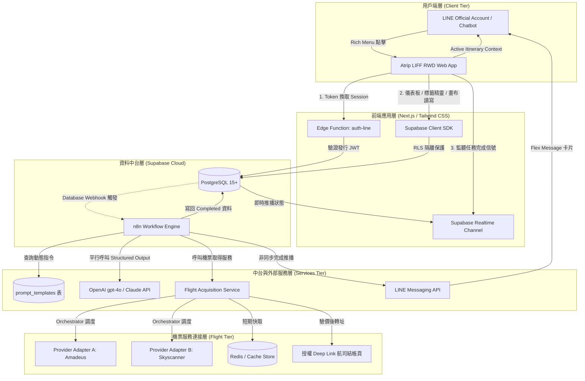

# Atrip 系統總綱與架構白皮書 (System Architecture & Master Specification)

* **產品名稱**：Atrip（你的 AI 自由行規劃夥伴）
* **專案代號**：Project Atrip
* **文件版本**：v2.0.0 (Final Unified Specification)
* **架構定位**：全棧前後端分離、事件驅動非同步管線、JSON-First 資料模型
* **統整來源**：完整融合 Yiru（架構與 Prompt 範本庫）、Jhen（UI 交互與 OpenAPI 規範）、Yie（非同步 Job 與安全運維）及 Lucas（授權機票資料取得服務）。

---

## 1. 產品願景與品牌設計系統 (Brand & Design System)

### 1.1 品牌核心理念
* **品牌名稱**：**Atrip**（A Trip ＋ AI，讀音自然聯想「a trip 一趟旅行」，將「AI」巧妙隱含於字母 `A` 與 `i` 之中）。
* **品牌副標**：**你的 AI 自由行規劃夥伴**。
* **品牌個性**：輕盈、年輕、直覺、可靠。以淡色目的地視覺佐以極簡高效的時間軸操作介面，徹底消除傳統旅遊規劃的繁瑣與混亂。

### 1.2 品牌色彩策略 (Color Tokens)
* **主色調 (Primary)**：`旅行藍` (`#347FA3`) —— 象徵智慧、清爽與天空航程。
* **次色調 (Secondary)**：`鼠尾草綠` (`#6F8F72`) —— 象徵自然、放鬆與探索陪伴。
* **中性背景色 (Background)**：`雲白灰` (`#F8FAFC`) / `畫布白` (`#FFFFFF`)。
* **強調色 (Accent)**：`暖日橘` (`#F97316`) —— 用於重要時間錨點 (Anchor Event) 與一鍵規劃主行動按鈕 (CTA)。

---

## 2. 總體系統架構與解耦拓撲 (System Architecture)

系統由 5 大子系統解耦構成，維持「前端輕量渲染、後端嚴格授權、中台管線化處理、機票獨立適配」之核心原則：

---

## 3. 核心設計原則與技術定調 (Architectural Tenets)

1. **前後端完全解耦 (Decoupled Architecture)**：
   * 前端（LIFF Mobile Web App）專注於雙層標籤精靈、動態畫布渲染、時間軸拖曳（Dnd）、地圖互動與 PDF 導出。
   * 後端與 n8n 負責 Token 驗證、任務排程、資料正規化與安全防護。
2. **JSON-First 資料模型與樂觀鎖控制**：
   * 行程主結構（日次、景點、交通、美食、住宿、打包清單）以版本化 `JSONB` 格式儲存於單一欄位，兼顧極速讀寫與原子性儲存，更新時強制比對 `version` 避免覆蓋。
3. **資料庫驅動之動態提示詞工程 (Database-Driven Prompts)**：
   * 捨棄硬編碼，將住宿策略（連住 Basecamp / 換宿行李寄放）、交通（捷運出口代碼）、賽事錨點等規則存於 `prompt_templates` 表，支援後台熱更新。
4. **合法授權機票資料取得服務 (No Web Scraping)**：
   * 嚴禁對消費者網站執行 DOM 爬蟲。全面採納 Lucas 提案，建置供應商中立的 Adapter 架構與短暫快取機制，聚焦「搜尋、比價、驗價與 Deep Link 導流」。
5. **非同步優先與雙軌通知機制 (Dual-Track Async Resilience)**：
   * 長耗時任務（15~40 秒）建立獨立 `itinerary_jobs` 追蹤，前台開著走 Supabase Realtime 秒級更新，跳出走 LINE Bot Flex Message 外部喚回。
6. **分層分享與社群擴散 (De-identified Public Share & Fork)**：
   * 外連分享免登入即可瀏覽「去個資版」行程；點擊「複製到我的行程 (Fork)」引導 LINE 登入並寫入個人名下。

---

## 4. 文件清單與導讀索引 (Specification Index)

本目錄完整包含可獨立分工落地的所有工程交付檔案：

* **[Final SPEC/SPEC.md](Final%20SPEC/SPEC.md)**：
  總體系統規格書（包含 33 條全覆蓋 User Stories、模組實作決策與端到端最高測試縫線定義）。
* **[Final SPEC/DATA_STRUCTURES.md](Final%20SPEC/DATA_STRUCTURES.md)**：
  全系統資料結構規格書（包含實體關係矩陣、狀態機、PostgreSQL 欄位規格、JSONB 結構、TypeScript 型別與校驗不變性）。
* **[01-產品需求規格與使用者流程(PRD).md](01-產品需求規格與使用者流程(PRD).md)**：
  完整產品功能清單、使用者故事、Atrip 雙層標籤精靈規格、互動畫布與行李清單規格。
* **[02-資料庫設計與SQL-DDL.md](02-資料庫設計與SQL-DDL.md)**：
  PostgreSQL 完整表結構（含 `profiles`, `user_preferences`, `prompt_templates`, `itineraries`, `itinerary_jobs`, `itinerary_shares`）、外鍵、索引與 RLS 政策。
* **[03-行程與偏好-JSON-Schema規格書.md](03-行程與偏好-JSON-Schema規格書.md)**：
  前端與後端型別依據（TypeScript Interfaces）及供 LLM Structured Output 強制驗證之 JSON Schemas。
* **[04-機票資料取得服務規格書(Flight-Service).md](04-機票資料取得服務規格書(Flight-Service).md)**：
  整合 Lucas 技術提案之機票搜尋調度器、供應商 Adapter、正規化、快取與驗價 Deep Link 規範。
* **[05-n8n工作流與非同步資料管線.md](05-n8n工作流與非同步資料管線.md)**：
  n8n 節點設計、配額頻率檢查、Prompt 動態拼接、平行調用容錯與 LINE Flex Message 規格。
* **[06-API協定契約書(OpenAPI-REST).md](06-API協定契約書(OpenAPI-REST).md)**：
  身分驗證、行程管理、Job 狀態輪詢、外連分享、Fork 交易與 PDF 匯出之完整 REST API 契約。
* **[07-安全運維驗收與開發排程.md](07-安全運維驗收與開發排程.md)**：
  資安架構、5 大高階測試縫線（Seams）、Sprint 0 ~ 4 落地開發計畫與驗收標準清單。

### 視覺化架構圖檔 (Draw.io Diagrams)
* 系統總體架構圖：[Final SPEC/diagrams/system-architecture.drawio](Final%20SPEC/diagrams/system-architecture.drawio)
* 資料庫實體關係圖：[Final SPEC/diagrams/database-erd.drawio](Final%20SPEC/diagrams/database-erd.drawio)
* n8n 工作流時序圖：[Final SPEC/diagrams/n8n-workflow-sequence.drawio](Final%20SPEC/diagrams/n8n-workflow-sequence.drawio)
* UI/UX 使用者流程圖：[Final SPEC/diagrams/user-flow.drawio](Final%20SPEC/diagrams/user-flow.drawio)
* 7人團隊開工依賴關係圖：[Final SPEC/diagrams/ticket-dependency-graph.drawio](Final%20SPEC/diagrams/ticket-dependency-graph.drawio)

### 架構決策紀錄 (Architecture Decision Records)
* [Final SPEC/adr/0001-json-first-itinerary-data-model.md](Final%20SPEC/adr/0001-json-first-itinerary-data-model.md)：採用 PostgreSQL JSONB 儲存完整行程。
* [Final SPEC/adr/0002-decoupled-async-generation-via-realtime-and-line-push.md](Final%20SPEC/adr/0002-decoupled-async-generation-via-realtime-and-line-push.md)：採用 Realtime ＋ LINE Bot 雙軌非同步通知。
* [Final SPEC/adr/0003-database-driven-prompt-directives.md](Final%20SPEC/adr/0003-database-driven-prompt-directives.md)：採用資料庫驅動動態提示詞範本表。
* [Final SPEC/adr/0004-authorized-flight-api-over-web-scraping.md](Final%20SPEC/adr/0004-authorized-flight-api-over-web-scraping.md)：採用合法授權機票 API ＋ 聯盟 Deep Link 導流取代爬蟲。
