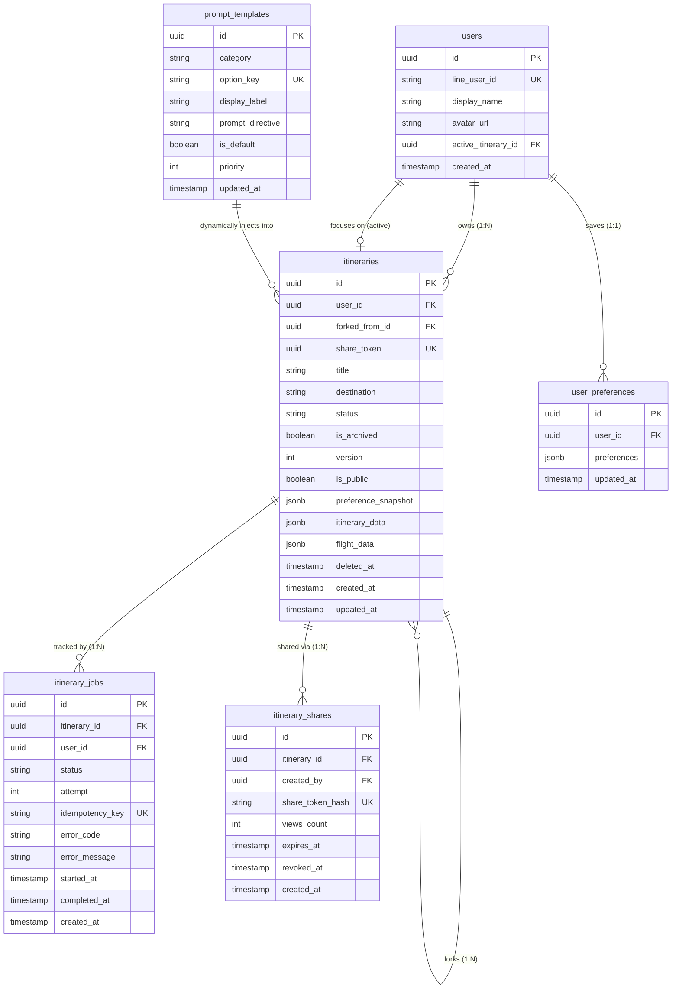

# 02 資料庫設計與 SQL DDL 規格書 (Database Schema & DDL)

* **專案代號**：Project Atrip
* **資料庫引擎**：PostgreSQL 15+ (Supabase Managed)
* **架構特色**：JSON-First 混合關聯模型、完全 RLS 隔離保護、軟刪除機制、非同步 Job 狀態機與動態 Prompt 範本庫。

---

## 1. 資料庫實體關係圖 (ERD)



---

## 2. 生產環境完整 SQL DDL 腳本 (DDL Script)

```sql
-- ==============================================================================
-- Atrip Production Database Schema
-- Version: 2.0.0
-- ==============================================================================

-- 1. 啟用必要的 PostgreSQL 延伸套件
CREATE EXTENSION IF NOT EXISTS "uuid-ossp";
CREATE EXTENSION IF NOT EXISTS "pgcrypto";

-- 2. 定義列舉型別 (Enum Types)
CREATE TYPE public.itinerary_job_status AS ENUM (
    'queued',
    'searching_flight',
    'generating_itinerary',
    'validating',
    'completed',
    'failed'
);

CREATE TYPE public.prompt_category AS ENUM (
    'accommodation',
    'transit',
    'interest',
    'pace',
    'budget'
);

-- ==============================================================================
-- 3. 資料表建立 (Tables)
-- ==============================================================================

-- 3.1 行程主表宣告 (因外鍵循環參照，先宣告 itineraries 再建 profiles)
CREATE TABLE public.itineraries (
    id UUID PRIMARY KEY DEFAULT uuid_generate_v4(),
    user_id UUID NOT NULL, -- 稍後加上外鍵約束
    forked_from_id UUID REFERENCES public.itineraries(id) ON DELETE SET NULL,
    share_token UUID UNIQUE DEFAULT uuid_generate_v4() NOT NULL,
    title TEXT NOT NULL DEFAULT '我的自訂行程',
    destination TEXT NOT NULL,
    status TEXT NOT NULL DEFAULT 'draft' CHECK (status IN ('draft', 'generating', 'completed', 'failed')),
    is_archived BOOLEAN NOT NULL DEFAULT false,
    version INT NOT NULL DEFAULT 1,
    is_public BOOLEAN NOT NULL DEFAULT true,
    preference_snapshot JSONB NOT NULL DEFAULT '{}'::jsonb,
    itinerary_data JSONB NOT NULL DEFAULT '{}'::jsonb,
    flight_data JSONB NOT NULL DEFAULT '[]'::jsonb,
    error_message TEXT,
    deleted_at TIMESTAMPTZ DEFAULT NULL, -- 軟刪除標記
    created_at TIMESTAMPTZ DEFAULT TIMEZONE('utc'::text, NOW()) NOT NULL,
    updated_at TIMESTAMPTZ DEFAULT TIMEZONE('utc'::text, NOW()) NOT NULL
);

-- 3.2 使用者資料表 (擴充 Supabase Auth Users)
CREATE TABLE public.profiles (
    id UUID PRIMARY KEY REFERENCES auth.users(id) ON DELETE CASCADE,
    line_user_id TEXT UNIQUE NOT NULL,
    display_name TEXT,
    avatar_url TEXT,
    active_itinerary_id UUID REFERENCES public.itineraries(id) ON DELETE SET NULL,
    created_at TIMESTAMPTZ DEFAULT TIMEZONE('utc'::text, NOW()) NOT NULL,
    updated_at TIMESTAMPTZ DEFAULT TIMEZONE('utc'::text, NOW()) NOT NULL
);

-- 補齊 itineraries.user_id 外鍵約束
ALTER TABLE public.itineraries
    ADD CONSTRAINT fk_itineraries_user FOREIGN KEY (user_id) REFERENCES public.profiles(id) ON DELETE CASCADE;

-- 3.3 使用者全域偏好表 (預設標籤按鈕快照)
CREATE TABLE public.user_preferences (
    id UUID PRIMARY KEY DEFAULT uuid_generate_v4(),
    user_id UUID NOT NULL REFERENCES public.profiles(id) ON DELETE CASCADE,
    preferences JSONB NOT NULL DEFAULT '{}'::jsonb,
    created_at TIMESTAMPTZ DEFAULT TIMEZONE('utc'::text, NOW()) NOT NULL,
    updated_at TIMESTAMPTZ DEFAULT TIMEZONE('utc'::text, NOW()) NOT NULL,
    CONSTRAINT unique_user_pref UNIQUE (user_id)
);

-- 3.4 動態提示詞範本表 (Prompt Directives Template Table)
CREATE TABLE public.prompt_templates (
    id UUID PRIMARY KEY DEFAULT uuid_generate_v4(),
    category public.prompt_category NOT NULL,
    option_key TEXT UNIQUE NOT NULL,
    display_label TEXT NOT NULL,
    prompt_directive TEXT NOT NULL,
    is_default BOOLEAN NOT NULL DEFAULT false,
    priority INT NOT NULL DEFAULT 0,
    created_at TIMESTAMPTZ DEFAULT TIMEZONE('utc'::text, NOW()) NOT NULL,
    updated_at TIMESTAMPTZ DEFAULT TIMEZONE('utc'::text, NOW()) NOT NULL
);

-- 3.5 非同步生成任務追蹤表 (Itinerary Jobs)
CREATE TABLE public.itinerary_jobs (
    id UUID PRIMARY KEY DEFAULT uuid_generate_v4(),
    itinerary_id UUID NOT NULL REFERENCES public.itineraries(id) ON DELETE CASCADE,
    user_id UUID NOT NULL REFERENCES public.profiles(id) ON DELETE CASCADE,
    status public.itinerary_job_status NOT NULL DEFAULT 'queued',
    attempt INT NOT NULL DEFAULT 0,
    idempotency_key TEXT UNIQUE NOT NULL,
    error_code TEXT,
    error_message TEXT,
    started_at TIMESTAMPTZ,
    completed_at TIMESTAMPTZ,
    created_at TIMESTAMPTZ DEFAULT TIMEZONE('utc'::text, NOW()) NOT NULL,
    updated_at TIMESTAMPTZ DEFAULT TIMEZONE('utc'::text, NOW()) NOT NULL
);

-- 3.6 外連分享記錄與稽核表 (Itinerary Shares)
CREATE TABLE public.itinerary_shares (
    id UUID PRIMARY KEY DEFAULT uuid_generate_v4(),
    itinerary_id UUID NOT NULL REFERENCES public.itineraries(id) ON DELETE CASCADE,
    created_by UUID NOT NULL REFERENCES public.profiles(id) ON DELETE CASCADE,
    share_token_hash TEXT UNIQUE NOT NULL,
    views_count INT NOT NULL DEFAULT 0,
    expires_at TIMESTAMPTZ NOT NULL,
    revoked_at TIMESTAMPTZ DEFAULT NULL,
    created_at TIMESTAMPTZ DEFAULT TIMEZONE('utc'::text, NOW()) NOT NULL
);

-- ==============================================================================
-- 4. 預設提示詞種子資料 (Prompt Template Seed Data)
-- ==============================================================================

INSERT INTO public.prompt_templates (category, option_key, display_label, prompt_directive, is_default, priority) VALUES
-- 住宿策略
('accommodation', 'single_hotel', '依推薦連住同一間', '【住宿約束】整趟行程必須以第 1 晚之推薦飯店作為每日出發與返回之固定 Basecamp，每日景點動線以該飯店為圓心規劃，行程中途嚴禁安排 Check-in/out 或更換住宿。', true, 10),
('accommodation', 'switch_hotel', '隨景點分區換宿', '【住宿與行李約束】行程允許隨景點區域更換住宿。更換飯店當日，必須在上午 09:00 前安排「行李寄存於原飯店或轉運車站」，並於 15:00-16:00 強制插入「前往新飯店 Check-in 放置行李」行程節點，前後景點必須順向排列，嚴禁折返跑。', false, 10),

-- 交通方式
('transit', 'public_transit', '大眾運輸優先', '【交通指引規範】所有景點間交通必須優先搭乘地鐵、捷運、公車或鐵路。在 transit_to_next 中必須精確輸出建議路線代碼（如「東京地鐵銀座線」）、搭乘方向、建議進出口名稱，以及預估步行與乘車時間。', true, 20),
('transit', 'self_drive', '租車自駕/包車', '【自駕指引規範】景點間交通以自駕車程為主。請估算行車距離、車程時間、推薦主要幹道或高速交流道，並於 tips 提示各景點周邊停車方便度與收費概況。', false, 20),

-- 主題偏好
('interest', 'gourmet', '喜愛在地美食', '【美食強化】每日午餐與晚餐必須安排當地高評價、具代表性的特色餐飲，避免觀光客陷阱餐廳，每餐停留時間需預留 60-90 分鐘。', true, 30),
('interest', 'shopping', '喜愛逛街購物', '【購物排程】每日下午或傍晚精選 1-2 個核心商圈、特色老街或購物中心（如銀座、澀谷、心齋橋），預留 2-3 小時充裕逛街時間。', false, 30),
('interest', 'sports', '熱血運動賽事', '【運動賽事與球場巡禮】推薦造訪當地知名體育場館（如巨蛋、足球場、歷史博物館）與官方旗艦商品店。若用戶提供特定比賽日期/時間，必須將該賽事設為不可撼動之主要時間錨點 (Anchor Event)，當天其他活動皆圍繞該球場安排。', false, 30),
('interest', 'cultural', '文青古蹟人文', '【文化參訪】優先推薦歷史悠久之神社、寺廟、美術館、博物館或歷史古道，景點描述需包含深度的文化背景導覽。', true, 30);

-- ==============================================================================
-- 5. 高效索引配置 (Indexes)
-- ==============================================================================

-- 軟刪除與活躍行程列表索引
CREATE INDEX idx_itineraries_user_active ON public.itineraries(user_id) 
    WHERE deleted_at IS NULL AND is_archived = false;
CREATE INDEX idx_itineraries_share_token ON public.itineraries(share_token);
CREATE INDEX idx_itineraries_status ON public.itineraries(status);
CREATE INDEX idx_itineraries_forked ON public.itineraries(forked_from_id);

-- JSONB GIN 倒排索引
CREATE INDEX idx_itineraries_data_gin ON public.itineraries USING GIN (itinerary_data);
CREATE INDEX idx_itineraries_flight_gin ON public.itineraries USING GIN (flight_data);

-- 提示詞字典索引
CREATE INDEX idx_prompt_templates_key ON public.prompt_templates(option_key);
CREATE INDEX idx_prompt_templates_default ON public.prompt_templates(category) WHERE is_default = true;

-- 任務隊列索引
CREATE INDEX idx_itinerary_jobs_lookup ON public.itinerary_jobs(itinerary_id, status);
CREATE INDEX idx_itinerary_jobs_user ON public.itinerary_jobs(user_id, created_at DESC);

-- 分享過期檢索索引
CREATE INDEX idx_itinerary_shares_hash ON public.itinerary_shares(share_token_hash);
CREATE INDEX idx_itinerary_shares_active ON public.itinerary_shares(itinerary_id) 
    WHERE revoked_at IS NULL AND expires_at > NOW();

-- ==============================================================================
-- 6. 自動更新 updated_at 觸發器 (Triggers)
-- ==============================================================================

CREATE OR REPLACE FUNCTION update_updated_at_column()
RETURNS TRIGGER AS $$
BEGIN
    NEW.updated_at = NOW();
    RETURN NEW;
END;
$$ LANGUAGE plpgsql;

CREATE TRIGGER update_profiles_updated_at BEFORE UPDATE ON public.profiles FOR EACH ROW EXECUTE PROCEDURE update_updated_at_column();
CREATE TRIGGER update_user_pref_updated_at BEFORE UPDATE ON public.user_preferences FOR EACH ROW EXECUTE PROCEDURE update_updated_at_column();
CREATE TRIGGER update_itineraries_updated_at BEFORE UPDATE ON public.itineraries FOR EACH ROW EXECUTE PROCEDURE update_updated_at_column();
CREATE TRIGGER update_prompt_templates_updated_at BEFORE UPDATE ON public.prompt_templates FOR EACH ROW EXECUTE PROCEDURE update_updated_at_column();
CREATE TRIGGER update_itinerary_jobs_updated_at BEFORE UPDATE ON public.itinerary_jobs FOR EACH ROW EXECUTE PROCEDURE update_updated_at_column();

-- ==============================================================================
-- 7. 安全性控制：Row Level Security (RLS) 政策
-- ==============================================================================

ALTER TABLE public.profiles ENABLE ROW LEVEL SECURITY;
ALTER TABLE public.user_preferences ENABLE ROW LEVEL SECURITY;
ALTER TABLE public.itineraries ENABLE ROW LEVEL SECURITY;
ALTER TABLE public.prompt_templates ENABLE ROW LEVEL SECURITY;
ALTER TABLE public.itinerary_jobs ENABLE ROW LEVEL SECURITY;
ALTER TABLE public.itinerary_shares ENABLE ROW LEVEL SECURITY;

-- 7.1 Profiles
CREATE POLICY "用戶可查看個人 Profile"
    ON public.profiles FOR SELECT
    USING (auth.uid() = id);

CREATE POLICY "用戶可更新個人 Profile"
    ON public.profiles FOR UPDATE
    USING (auth.uid() = id);

-- 7.2 Preferences
CREATE POLICY "用戶可管理自身偏好"
    ON public.user_preferences FOR ALL
    USING (auth.uid() = user_id);

-- 7.3 Prompt Templates (公開唯讀供前端/n8n 查詢)
CREATE POLICY "所有人皆可查詢提示詞範本"
    ON public.prompt_templates FOR SELECT
    TO anon, authenticated
    USING (true);

-- 7.4 Itineraries
CREATE POLICY "擁有者可檢視未軟刪除之個人行程"
    ON public.itineraries FOR SELECT
    USING (auth.uid() = user_id AND deleted_at IS NULL);

CREATE POLICY "擁有者可新增個人行程"
    ON public.itineraries FOR INSERT
    WITH CHECK (auth.uid() = user_id);

CREATE POLICY "擁有者可更新個人行程"
    ON public.itineraries FOR UPDATE
    USING (auth.uid() = user_id)
    WITH CHECK (auth.uid() = user_id);

CREATE POLICY "擁有者可軟刪除或刪除個人行程"
    ON public.itineraries FOR DELETE
    USING (auth.uid() = user_id);

CREATE POLICY "外連訪客可唯讀檢視公開未刪除之行程"
    ON public.itineraries FOR SELECT
    TO anon, authenticated
    USING (is_public = true AND share_token IS NOT NULL AND deleted_at IS NULL);

-- 7.5 Itinerary Jobs
CREATE POLICY "用戶可查看個人任務進度"
    ON public.itinerary_jobs FOR SELECT
    USING (auth.uid() = user_id);

-- 7.6 Itinerary Shares
CREATE POLICY "擁有者可管理個人分享記錄"
    ON public.itinerary_shares FOR ALL
    USING (auth.uid() = created_by);

CREATE POLICY "訪客可依 Token 驗證分享有效性"
    ON public.itinerary_shares FOR SELECT
    TO anon, authenticated
    USING (revoked_at IS NULL AND expires_at > NOW());

-- ==============================================================================
-- 8. 啟用 Realtime 廣播通道
-- ==============================================================================

ALTER PUBLICATION supabase_realtime ADD TABLE public.itineraries;
ALTER PUBLICATION supabase_realtime ADD TABLE public.itinerary_jobs;
```
