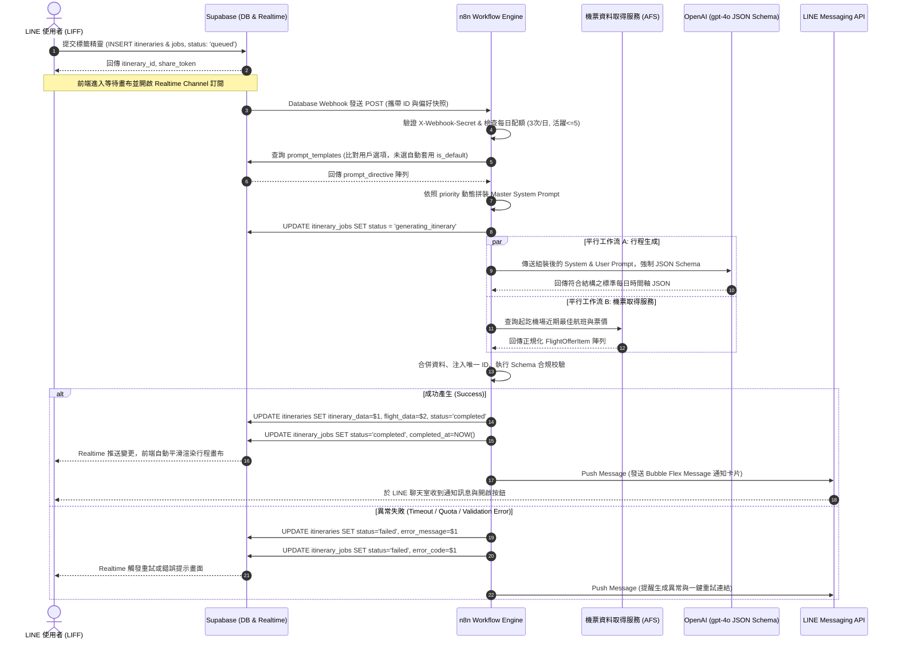

# 05 n8n 工作流與非同步資料管線規格書 (Workflow Automation & Async Pipeline)

* **專案代號**：Project Atrip
* **工作流引擎**：n8n (Self-hosted on Railway / Render or n8n Cloud)
* **版本**：v2.0.0
* **核心使命**：串聯 Supabase 異動觸發、動態 Prompt 組裝、平行調用 LLM 與機票服務、資料驗證入庫，並透過 LINE Messaging API 發送推播。

---

## 1. n8n 端到端工作流時序圖 (End-to-End Sequence Diagram)



---

## 2. n8n 核心節點詳細配置規格 (Node-by-Node Specs)

### 節點 1：Webhook Ingress (Supabase DB Webhook)
* **節點型態**：`n8n-nodes-base.webhook`
* **HTTP Method**：`POST`
* **路徑**：`/webhook/v1/generate-itinerary`
* **安全機制**：
  * 檢查 Request Header `X-Webhook-Secret === $env.SUPABASE_WEBHOOK_SECRET`。
  * 提取欄位：`itinerary_id`, `user_id`, `preference_snapshot`。

### 節點 2：用戶配額與頻率檢查 (Quota & Rate Limiting Guard)
* **節點型態**：`n8n-nodes-base.code`
* **檢查項目**：
  1. 呼叫 Supabase RPC 或 Query：計算該 `user_id` 在 `itinerary_jobs` 中今日建立之數量是否 $\ge 3$。
  2. 計算目前活躍未封存之行程數量是否 $\ge 5$。
* **分流處理**：若超過上限，直接更新狀態為 `failed`，設定 `error_code = 'QUOTA_EXCEEDED'` 並終止流程。

### 節點 3：動態提示詞載入 (Fetch Prompt Directives)
* **節點型態**：`n8n-nodes-base.supabase`
* **查詢邏輯**：
  ```sql
  SELECT option_key, prompt_directive, priority 
  FROM public.prompt_templates 
  WHERE option_key = ANY({{ $json.preference_snapshot.interests }})
     OR option_key = {{ $json.preference_snapshot.accommodation_strategy }}
     OR option_key = {{ $json.preference_snapshot.transit_mode }}
     OR (is_default = true AND category NOT IN (
         SELECT category FROM public.prompt_templates 
         WHERE option_key = ANY({{ $json.preference_snapshot.interests }})
     ))
  ORDER BY priority ASC;
  ```
* **組裝邏輯**：將多筆 `prompt_directive` 串接為結構化指令段落，動態嵌入 Base System Prompt。

### 節點 4：平行分支調用 (Parallel Execution)
* **分支 A (LLM OpenAI 節點)**：
  * **Model**：`gpt-4o-2024-08-06` 或更新版本。
  * **參數**：`temperature: 0.2`（維持高穩定度與事實性）、`response_format` 注入 `atrip_itinerary_schema`。
* **分支 B (Flight Service 節點)**：
  * 呼叫機票取得服務 API：`GET /api/v1/flights/search`。
  * 設定 `Continue On Fail: True`，即使第三方供應商超時，回傳空陣列或快取資料，確保行程生成主幹不中斷。

### 節點 5：資料清洗與唯一 ID 注入 (Data Sanitization & Injection)
* **節點型態**：`n8n-nodes-base.code`
* **處理邏輯**：
  * 解析 LLM 回傳之 JSON。
  * 遍歷 `daily_itinerary[].activities[]`，若無 `id` 或格式不符，自動生成 `act-d{day}-{index}-{uuid_short}` 唯一鍵值，確保前端拖曳重排相容性。
  * 合併機票陣列至 `flight_data` 欄位。

### 節點 6：資料庫狀態寫回 (Supabase Update Node)
* **目標資料表**：`itineraries` 與 `itinerary_jobs`。
* **寫入內容**：
  * `itineraries.itinerary_data` = 清洗後的行程 JSON。
  * `itineraries.flight_data` = 機票陣列。
  * `itineraries.status` = `'completed'`。
  * `itinerary_jobs.status` = `'completed'`, `completed_at` = `NOW()`。

### 節點 7：LINE Flex Message 推播通知 (Push Message Node)
* **API 端點**：`POST https://api.line.me/v2/bot/message/push`
* **Headers**：`Authorization: Bearer {{ $env.LINE_CHANNEL_ACCESS_TOKEN }}`
* **Flex Message 氣泡卡片規格**：
  * **Header**：色調 `#347FA3`（Atrip 旅行藍），文字「🎉 您的專屬自由行已規劃就緒！」。
  * **Body**：
    * 標題：行程自訂標題（如「東京 5 天 4 夜慢活文藝與在地美食探索」）。
    * 資訊列：目的地、出發日期、天數、特色標籤 Chips（`#在地老饕` `#大眾運輸`）。
  * **Footer Action**：主按鈕「開啟 Atrip 專屬行程」，URI 綁定 LIFF 專屬深度連結：`https://liff.line.me/{liffId}?itinerary_id={itineraryId}`。

---

## 3. 重試策略與死信隊列 (Retry Policy & Failure Recovery)

1. **單一節點重試機制**：
   * LLM API 呼叫：配置 `Max Tries: 2`，重試等待間隔 `Wait Between Tries: 3000ms`。
   * 機票 API 呼叫：配置 `Max Tries: 1`（超時即降級，不重試以防累積延遲）。
2. **失敗後續處置 (Error Fallback)**：
   * 若 LLM 發生無法解析之語法錯誤或超時，觸發 Catch 節點，更新 `itinerary_jobs` 狀態為 `failed`，記錄 `error_message`。
   * LINE Bot 推播通知用戶「很抱歉，行程規劃遭遇網路波動，請點擊此處免費重新規劃」。
