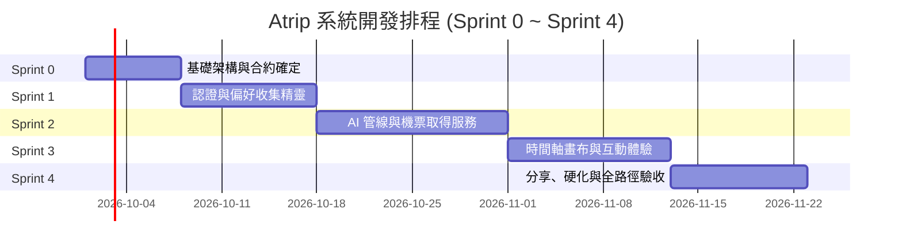

# 07 安全運維、驗收標準與開發排程 (Security, QA & Roadmap)

* **專案代號**：Project Atrip
* **版本**：v2.0.0
* **目標**：提供生產級的資安運維準則、5 大高階測試縫線驗收標準，以及清晰的 Sprint 0 ~ 4 敏捷開發排程。

---

## 1. 資訊安全與隱私防護準則 (Security & Privacy Governance)

### 1.1 密鑰與最小權限原則 (Least Privilege)
* **`service_role` 永不進瀏覽器**：Supabase `service_role` 密鑰僅限存在於 Supabase Edge Functions、n8n 後端工作流與安全的 Worker 環境，嚴禁暴露於前端客戶端或 Git 版控中。
* **前端僅持有 `anon` 密鑰與使用者專屬 JWT**：所有前端讀寫行為強制受 PostgreSQL Row Level Security (RLS) 政策限制。

### 1.2 外連分享去識別化規範 (De-identification Standards)
* 未登入訪客透過 `https://atrip.app/share/[share_token]` 存取時，前端與 API 必須執行去識別化遮蔽：
  * **強制移除**：建立者姓名 (`display_name`)、大頭照 (`avatar_url`)、LINE UID。
  * **強制隱藏**：預算等級與具體預算數字 (`budget_level`, `cost_estimate`)。
  * **保留內容**：僅開放行程時間軸卡片、景點名稱、介紹與地理座標。

### 1.3 提示詞注入與惡意攻擊防護 (Prompt Injection Defense)
* 用戶輸入之景點自訂備註（如賽事時間錨點）在組裝進 Prompt 前，必須經過消毒過濾（Sanitization），禁止含有引導忽略 System Prompt 的指令式字串（如 `Ignore all previous instructions`）。
* 前端不直接組裝 Prompt，所有提示詞指令強制在資料庫表 `prompt_templates` 中集中管理與映射。

---

## 2. 核心測試縫線與驗收標準 (QA Acceptance Criteria)

遵循「只測試外部可觀測之行為，絕不測試組件內部實作細節」之原則，設定 5 大高階驗收縫線：

| 測試縫線 (Testing Seams) | 驗收場景與行為斷言 (Acceptance Criteria) | 通過標準 (Pass Definition) |
| :--- | :--- | :--- |
| **Seam 1: 資料庫 RLS 權限與軟刪除安全** | 1. 模擬 User A 嘗試讀取或更新 User B 的行程。 2. 模擬未登入訪客讀取標註 `deleted_at` 或 `is_public = false` 的行程。 3. 驗證非 Admin 角色無法對 `prompt_templates` 進行寫入。 | 1. 跨帳號讀寫立即回傳 404 或空陣列。 2. 軟刪除行程對外完全隱蔽。 3. 提示詞表拒絕未授權 UPDATE/DELETE。 |
| **Seam 2: 模組化 Prompt 組裝與預設回退** | 1. 給定用戶勾選 `['single_hotel', 'sports']`，驗證 n8n 查詢並組合出的 Prompt 包含 Basecamp 約束與運動場館錨點指令。 2. 給定空標籤清單 `[]`，驗證系統精確回退並拼接所有 `is_default = true` 的各類別預設語句。 | 產出之 System Prompt 字串必須 100% 包含指定選項對應的 directive，且優先順序依 `priority` 由低到高排列。 |
| **Seam 3: LLM 結構化輸出合規校驗** | 使用真實與 Mock LLM 回傳字串，執行 Ajv JSON Schema 嚴格校驗。 | 1. 必須 100% 通過 `atrip_itinerary_schema` 校驗。 2. 所有座標數值合規且活動具備唯一識別碼。 |
| **Seam 4: 前端時間軸拖曳與樂觀鎖版本衝突** | 1. 前端在手機介面長按拖曳景點更換順序，檢查網路請求。 2. 模擬其他裝置已將版本號推進（Version Mismatch）。 | 1. 觸發防抖 800ms 整包更新，版本號自增。 2. 版本衝突時，前端跳出友善提示並重新拉取最新資料。 |
| **Seam 5: 複製副本 (Fork) 交易獨立性** | 訪客在分享頁面點擊「複製到我的行程」，完成登入授權。 | 1. 資料庫產生全新紀錄，`forked_from_id` 指向原行程。 2. 該副本後續任意增刪改，原行程絲毫不受影響。 |

---

## 3. 敏捷開發排程與里程碑 (Sprint Roadmap)

### 3.1 Sprint 0：契約與基礎設施 (Week 1)
* **目標**：確立所有資料模型、遷移腳本與 CI/CD 部署管線。
* **交付物**：
  * Supabase PostgreSQL 完整 DDL 執行與 RLS 政策部署。
  * `prompt_templates` 種子資料灌入。
  * Vercel 前端容器與 n8n 開發環境建立。

### 3.2 Sprint 1：LINE 認證、儀表板與標籤精靈 (Week 2 ~ 3)
* **目標**：打通使用者進站、身分映射與需求收集閉環。
* **交付物**：
  * `auth-line` Edge Function 與 LIFF 免密登入對接。
  * Atrip 我的行程儀表板（支援進行中、封存與 Active 行程鎖定）。
  * 雙層標籤精靈介面（一鍵懶人套版 Preset Bundles ＋ 0 點擊直出機制）。

### 3.3 Sprint 2：AI 行程生成管線與機票資料取得服務 (Week 4 ~ 5)
* **目標**：串通 n8n、OpenAI Structured Output 與合法機票 API。
* **交付物**：
  * n8n Webhook 觸發、配額頻率防刷（3 次/日）與動態 Prompt 拼裝節點。
  * 機票資料取得服務（Search Orchestrator、Amadeus/Skyscanner Adapter、短期快取與評分）。
  * 行李打包清單智能生成。
  * LINE Messaging API Flex Message 推播通知整合。

### 3.4 Sprint 3：動態行程主畫布與地圖視覺化 (Week 6 ~ 7)
* **目標**：實現極致流暢的前端排程、拖拉編輯與地理空間連動。
* **交付物**：
  * 每日時間軸卡片與交通轉乘標籤渲染。
  * `@hello-pangea/dnd` 景點拖曳重排與 800ms 防抖整包寫回。
  * Mapbox / Leaflet 地圖標記與卡片點擊平滑移動 (FlyTo)。
  * Supabase Realtime 生成狀態動態監聽。

### 3.5 Sprint 4：社群分享、PDF 匯出與全面硬化上線 (Week 8)
* **目標**：完成病毒式社群複製、離線檔案匯出與生產環境壓力測試。
* **交付物**：
  * 去識別化唯讀外連分享頁面 (`/share/:token`)。
  * 訪客一鍵「複製到我的行程 (Fork)」交易邏輯。
  * `@media print` 專用列印樣板與 LINE Bot 實體 PDF 檔案推播。
  * 5 大測試縫線通過報告與正式上線營運監控。

---

## 4. 維運緊急應變處置手冊 (Operational Runbook)

1. **外部 LLM 發生大規模逾時故障**：
   * n8n 自動觸發 Catch 節點，更新 `itinerary_jobs.status = 'failed'`。
   * LINE Bot 自動推播致歉通知，並附帶保留偏好參數的「免費重試連結」。
2. **機票供應商 API 觸發 429 限流**：
   * 搜尋調度器（Orchestrator）自動啟動 Circuit Breaker 熔斷器。
   * 自動啟動 Provider Fallback 降級機制，提取近 2 小時內的歷史快取價格，並於卡片加註「參考預估票價」。
3. **用戶達到每日生成上限 (3 次)**：
   * 系統拒絕建立新 Job，前端顯示溫馨提示：「您今日的 AI 規劃額度已滿（每日上限 3 次），建議手動調整現有行程，明日 00:00 自動重置」。
