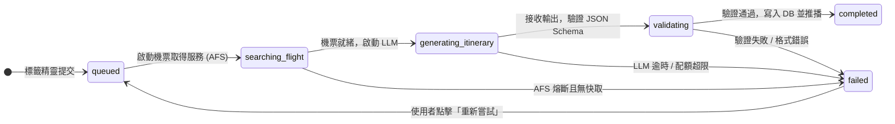

# Atrip 全系統資料結構與領域模型規格書 (System Data Structures & Domain Model Specification)

* **專案名稱**：Atrip（你的 AI 自由行規劃夥伴）
* **文件版本**：v2.0.0 (Unified Final Edition)
* **關聯依據**：[Final SPEC/00-系統總綱與架構白皮書.md](Final%20SPEC/00-系統總綱與架構白皮書.md)、[Final SPEC/SPEC.md](Final%20SPEC/SPEC.md)、[CONTEXT.md](CONTEXT.md)
* **核心地位**：本文件為全專案資料模型、資料庫結構、通訊協定與型別定義之**唯一真理之源（Single Source of Truth）**，規範所有模組之資料表達方式。

---

## 1. 領域實體與概念模型 (Domain Entities & Value Objects)

### 1.1 核心實體矩陣 (Core Entities Matrix)

| 領域實體 (Domain Entity) | 資料庫實體表 | 識別主鍵 | 關聯歸屬 | 領域職責說明 |
| :--- | :--- | :--- | :--- | :--- |
| **Profile** (會員資料) | `public.profiles` | `id` (UUID) | $\rightarrow$ `auth.users(id)`<br>$\rightarrow$ `itineraries(id)` (Active) | 記錄使用者 LINE 身份、暱稱、頭貼與當前關注之行程（LINE Bot 上下文）。 |
| **UserPreference** (全域偏好) | `public.user_preferences` | `id` (UUID) | $\rightarrow$ `profiles(id)` | 記錄使用者的全域常用標籤與旅遊習慣，作為新開行程時的預填範本。 |
| **PromptTemplate** (動態提示詞) | `public.prompt_templates` | `id` (UUID) | 獨立字典實體 | 儲存各偏好選項對應之 Prompt 約束語句、預設值與組裝權重，支援熱更新。 |
| **Itinerary** (旅遊行程) | `public.itineraries` | `id` (UUID) | $\rightarrow$ `profiles(id)`<br>$\rightarrow$ `itineraries(id)` (Forked) | 核心行程主體，以 JSON-First 模式儲存每日排程、地圖坐標、交通與機票。 |
| **ItineraryJob** (生成任務) | `public.itinerary_jobs` | `id` (UUID) | $\rightarrow$ `itineraries(id)`<br>$\rightarrow$ `profiles(id)` | 追蹤非同步長耗時生成管線的生命週期，提供冪等性防重複與重試控制。 |
| **ItineraryShare** (分享權杖) | `public.itinerary_shares` | `id` (UUID) | $\rightarrow$ `itineraries(id)`<br>$\rightarrow$ `profiles(id)` | 管理去識別化外連分享連結、過期時間 (`expires_at`) 與主動撤回標記。 |

---

### 1.2 狀態機與列舉定義 (State Machines & Enums)



#### 核心列舉值域 (Enumerations)
* **`ItineraryStatus`**（行程主表狀態）：`'draft'` | `'generating'` | `'completed'` | `'failed'`
* **`ItineraryJobStatus`**（任務排程狀態）：`'queued'` | `'searching_flight'` | `'generating_itinerary'` | `'validating'` | `'completed'` | `'failed'`
* **`PromptCategory`**（提示詞分類）：`'accommodation'` | `'transit'` | `'interest'` | `'pace'` | `'budget'`
* **`PaceLevel`**（步調節奏）：`'relaxed'` (慢活 2~3 景點) | `'moderate'` (適中 3~4 景點) | `'packed'` (充實 5~6 景點)
* **`BudgetLevel`**（預算等級）：`'budget'` (小資平價) | `'standard'` (舒適標準) | `'luxury'` (尊榮奢華)
* **`AccommodationStrategy`**（住宿策略）：`'single_hotel'` (連住同一間) | `'switch_hotel'` (隨景點分區換宿)
* **`TransitMode`**（交通模式）：`'public_transit'` (大眾運輸優先) | `'self_drive'` (租車自駕/包車)
* **`ActivityCategory`**（活動分類）：`'sightseeing'` | `'dining'` | `'shopping'` | `'transit'` | `'relaxation'` | `'accommodation_checkin'` | `'sports_event'`
* **`TransitType`**（交通載具）：`'subway'` | `'bus'` | `'walking'` | `'taxi'` | `'train'` | `'driving'`

---

## 2. PostgreSQL 實體關聯資料表規格 (Relational DDL & Columns)

### 2.1 `public.profiles` (使用者資料表)
記錄使用者的 LINE 身分與關聯設定。
* `id`: `UUID PRIMARY KEY REFERENCES auth.users(id) ON DELETE CASCADE`
* `line_user_id`: `TEXT UNIQUE NOT NULL`（LINE 唯一 ID，以 `U` 開頭）
* `display_name`: `TEXT NULL`
* `avatar_url`: `TEXT NULL`
* `active_itinerary_id`: `UUID NULL REFERENCES public.itineraries(id) ON DELETE SET NULL`（鎖定之 Active 行程）
* `created_at`: `TIMESTAMPTZ NOT NULL DEFAULT TIMEZONE('utc', NOW())`
* `updated_at`: `TIMESTAMPTZ NOT NULL DEFAULT TIMEZONE('utc', NOW())`

### 2.2 `public.user_preferences` (全域偏好表)
記錄單一用戶的預設常用標籤，一對一關聯。
* `id`: `UUID PRIMARY KEY DEFAULT uuid_generate_v4()`
* `user_id`: `UUID UNIQUE NOT NULL REFERENCES public.profiles(id) ON DELETE CASCADE`
* `preferences`: `JSONB NOT NULL DEFAULT '{}'::jsonb`（預設偏好快照）
* `created_at`: `TIMESTAMPTZ NOT NULL DEFAULT TIMEZONE('utc', NOW())`
* `updated_at`: `TIMESTAMPTZ NOT NULL DEFAULT TIMEZONE('utc', NOW())`

### 2.3 `public.prompt_templates` (動態提示詞範本表)
維護各偏好選項的 Prompt 約束指令，支援免重啟動態熱更新。
* `id`: `UUID PRIMARY KEY DEFAULT uuid_generate_v4()`
* `category`: `public.prompt_category NOT NULL`
* `option_key`: `TEXT UNIQUE NOT NULL`（例如：`single_hotel`, `sports`, `public_transit`）
* `display_label`: `TEXT NOT NULL`（前端 Chip 按鈕文字）
* `prompt_directive`: `TEXT NOT NULL`（具體給 LLM 的約束文字）
* `is_default`: `BOOLEAN NOT NULL DEFAULT false`（是否為懶人預設套版項）
* `priority`: `INT NOT NULL DEFAULT 0`（組裝順序權重，數值小者優先注入）
* `created_at`: `TIMESTAMPTZ NOT NULL DEFAULT TIMEZONE('utc', NOW())`
* `updated_at`: `TIMESTAMPTZ NOT NULL DEFAULT TIMEZONE('utc', NOW())`

### 2.4 `public.itineraries` (行程主表)
核心行程資料庫，採用 JSON-First 混合模式。
* `id`: `UUID PRIMARY KEY DEFAULT uuid_generate_v4()`
* `user_id`: `UUID NOT NULL REFERENCES public.profiles(id) ON DELETE CASCADE`
* `forked_from_id`: `UUID NULL REFERENCES public.itineraries(id) ON DELETE SET NULL`（副本來源）
* `share_token`: `UUID UNIQUE NOT NULL DEFAULT uuid_generate_v4()`（專屬分享權杖）
* `title`: `TEXT NOT NULL DEFAULT '我的自訂行程'`
* `destination`: `TEXT NOT NULL`
* `status`: `TEXT NOT NULL DEFAULT 'draft' CHECK (status IN ('draft', 'generating', 'completed', 'failed'))`
* `is_archived`: `BOOLEAN NOT NULL DEFAULT false`
* `version`: `INT NOT NULL DEFAULT 1`（樂觀鎖版本號）
* `is_public`: `BOOLEAN NOT NULL DEFAULT true`
* `preference_snapshot`: `JSONB NOT NULL DEFAULT '{}'::jsonb`（獨立偏好快照）
* `itinerary_data`: `JSONB NOT NULL DEFAULT '{}'::jsonb`（完整行程時間軸與推薦）
* `flight_data`: `JSONB NOT NULL DEFAULT '[]'::jsonb`（正規化機票比價陣列）
* `error_message`: `TEXT NULL`
* `deleted_at`: `TIMESTAMPTZ NULL`（軟刪除時間戳記）
* `created_at`: `TIMESTAMPTZ NOT NULL DEFAULT TIMEZONE('utc', NOW())`
* `updated_at`: `TIMESTAMPTZ NOT NULL DEFAULT TIMEZONE('utc', NOW())`

### 2.5 `public.itinerary_jobs` (非同步任務追蹤表)
負責非同步工作流的排程、重試與冪等性保護。
* `id`: `UUID PRIMARY KEY DEFAULT uuid_generate_v4()`
* `itinerary_id`: `UUID NOT NULL REFERENCES public.itineraries(id) ON DELETE CASCADE`
* `user_id`: `UUID NOT NULL REFERENCES public.profiles(id) ON DELETE CASCADE`
* `status`: `public.itinerary_job_status NOT NULL DEFAULT 'queued'`
* `attempt`: `INT NOT NULL DEFAULT 0`
* `idempotency_key`: `TEXT UNIQUE NOT NULL`（格式：`job:{user_id}:{itinerary_id}:{timestamp}`）
* `error_code`: `TEXT NULL`
* `error_message`: `TEXT NULL`
* `started_at`: `TIMESTAMPTZ NULL`
* `completed_at`: `TIMESTAMPTZ NULL`
* `created_at`: `TIMESTAMPTZ NOT NULL DEFAULT TIMEZONE('utc', NOW())`
* `updated_at`: `TIMESTAMPTZ NOT NULL DEFAULT TIMEZONE('utc', NOW())`

### 2.6 `public.itinerary_shares` (外連分享記錄與稽核表)
管理外連分享有效期限與安全防護。
* `id`: `UUID PRIMARY KEY DEFAULT uuid_generate_v4()`
* `itinerary_id`: `UUID NOT NULL REFERENCES public.itineraries(id) ON DELETE CASCADE`
* `created_by`: `UUID NOT NULL REFERENCES public.profiles(id) ON DELETE CASCADE`
* `share_token_hash`: `TEXT UNIQUE NOT NULL`
* `views_count`: `INT NOT NULL DEFAULT 0`
* `expires_at`: `TIMESTAMPTZ NOT NULL`
* `revoked_at`: `TIMESTAMPTZ NULL`
* `created_at`: `TIMESTAMPTZ NOT NULL DEFAULT TIMEZONE('utc', NOW())`

---

## 3. JSONB 欄位微觀資料結構定義 (Micro-Level JSONB Schemas)

### 3.1 `itineraries.preference_snapshot`
儲存行程建立時的獨立標籤參數快照：
```json
{
  "destination": "東京",
  "total_days": 5,
  "start_date": "2026-10-15",
  "end_date": "2026-10-19",
  "pace": "relaxed",
  "budget_level": "standard",
  "accommodation_strategy": "single_hotel",
  "transit_mode": "public_transit",
  "interests": ["gourmet", "cultural", "sports"],
  "event_note": "週五晚間 18:00 東京巨蛋棒球賽 (巨人 vs 阪神)",
  "selected_bundle": "classic_bundle"
}
```

### 3.2 `itineraries.itinerary_data`
儲存核心行程、每日時間軸、地圖坐標、交通換乘與打包清單：
```json
{
  "meta": {
    "trip_title": "東京 5 天 4 夜慢活文藝與在地美食探索",
    "destination": "東京, 日本",
    "total_days": 5,
    "currency": "TWD",
    "budget_level": "standard",
    "pace": "relaxed"
  },
  "daily_itinerary": [
    {
      "day_number": 1,
      "date_label": "Day 1 - 抵達東京與下町漫遊",
      "summary": "搭機抵達羽田機場，入住淺草推薦飯店 (Basecamp)，午後雷門參拜與晴空塔絕美夜景。",
      "activities": [
        {
          "id": "act-d1-01",
          "time_slot": "14:30 - 16:00",
          "location_name": "淺草雷門與仲見世商店街",
          "category": "sightseeing",
          "duration_minutes": 90,
          "description": "漫步傳統老街，感受江戶下町氛圍，品嚐現烤仙貝與人形燒。",
          "coordinates": {
            "lat": 35.7111,
            "lng": 139.7964
          },
          "cost_estimate": 300,
          "tips": "下午人潮熱絡，建議由雷門步行至淺草寺本堂。",
          "transit_to_next": {
            "mode": "walking",
            "duration_minutes": 20,
            "route_name": "吾妻橋水岸步道",
            "instructions": "穿過隅田川吾妻橋，沿著河岸步道漫步至晴空塔。"
          }
        },
        {
          "id": "act-d1-02",
          "time_slot": "16:30 - 19:00",
          "location_name": "東京晴空塔 (Tokyo Skytree)",
          "category": "sightseeing",
          "duration_minutes": 150,
          "description": "登上展望台俯瞰全東京百萬日落夜景，商場自由逛街用餐。",
          "coordinates": {
            "lat": 35.7101,
            "lng": 139.8107
          },
          "cost_estimate": 700,
          "tips": "建議預先於網路購票免排隊，展望台日落時間約在 17:15。"
        }
      ]
    }
  ],
  "transit_overview": [
    {
      "from_zone": "市區所有地鐵站",
      "to_zone": "各景點景區",
      "suggested_pass": "Tokyo Subway 72-Hour Ticket",
      "estimated_cost": 330,
      "notes": "全線東京地下鐵與都營地下鐵無限搭乘，最省錢且班次密集。"
    }
  ],
  "recommendations": {
    "dining": [
      {
        "name": "淺草今半 (Asakusa Imahan)",
        "type": "百年壽喜燒",
        "rating": 4.6,
        "approx_cost": "¥3,500 - ¥8,000",
        "address": "東京都台東区西浅草3-1-12",
        "reason": "日本頂級黑毛和牛老店，午間定食 CP 值極高。",
        "google_map_query": "Asakusa Imahan Sukiyaki"
      }
    ],
    "accommodations": [
      {
        "name": "THE GATE HOTEL 雷門 by HULIC",
        "type": "設計型景觀飯店",
        "rating": 4.5,
        "approx_cost": "TWD 4,200 / 晚",
        "address": "東京都台東区雷門2-16-11",
        "reason": "頂樓露台可直面晴空塔，距離淺草站步行僅 2 分鐘，適合做為 5 天 Basecamp。",
        "google_map_query": "The Gate Hotel Asakusa"
      }
    ]
  },
  "packing_list": [
    {
      "id": "pack-01",
      "category": "essentials",
      "item_name": "護照 (有效期限 6 個月以上)",
      "is_checked": false,
      "notes": "必備證件"
    },
    {
      "id": "pack-02",
      "category": "clothing",
      "item_name": "防風保暖外套與舒適步行鞋",
      "is_checked": false,
      "notes": "10 月東京日夜溫差約 8-10 度"
    },
    {
      "id": "pack-03",
      "category": "electronics",
      "item_name": "日本專用 eSIM / SIM 卡與行動電源",
      "is_checked": false,
      "notes": "日行萬步導航耗電"
    }
  ]
}
```

### 3.3 `itineraries.flight_data`
儲存由機票資料取得服務 (AFS) 查詢、評分與正規化之即時航班資料：
```json
[
  {
    "id": "fl-offer-001",
    "provider": "Amadeus",
    "outbound": {
      "departure_time": "2026-10-15T08:50:00+08:00",
      "arrival_time": "2026-10-15T12:55:00+09:00",
      "duration": "3小時05分",
      "stops": 0,
      "segments": [
        {
          "airline_code": "BR",
          "airline_name": "長榮航空 (EVA Air)",
          "flight_number": "BR198",
          "aircraft": "A330-300",
          "departure": {
            "airport_code": "TSA",
            "airport_name": "台北松山機場",
            "time": "2026-10-15T08:50:00+08:00"
          },
          "arrival": {
            "airport_code": "HND",
            "airport_name": "東京羽田機場",
            "time": "2026-10-15T12:55:00+09:00"
          },
          "duration_minutes": 185
        }
      ]
    },
    "inbound": {
      "departure_time": "2026-10-19T14:15:00+09:00",
      "arrival_time": "2026-10-19T17:15:00+08:00",
      "duration": "4小時00分",
      "stops": 0,
      "segments": [
        {
          "airline_code": "BR",
          "airline_name": "長榮航空 (EVA Air)",
          "flight_number": "BR197",
          "aircraft": "A330-300",
          "departure": {
            "airport_code": "HND",
            "airport_name": "東京羽田機場",
            "time": "2026-10-19T14:15:00+09:00"
          },
          "arrival": {
            "airport_code": "TSA",
            "airport_name": "台北松山機場",
            "time": "2026-10-19T17:15:00+08:00"
          },
          "duration_minutes": 240
        }
      ]
    },
    "price_total_twd": 14250,
    "baggage_included": "含 1 件 23kg 托運行李與手提 7kg",
    "deep_link_url": "https://partners.atrip.app/deeplink/checkout?offer_id=fl-offer-001&source=evaair",
    "checked_at": "2026-09-14T08:00:00Z",
    "expires_at": "2026-09-14T08:20:00Z"
  }
]
```

---

## 4. 全棧 TypeScript 型別定義 (Full-Stack TypeScript Definitions)

```typescript
// ==============================================================================
// Atrip Full-Stack Types
// ==============================================================================

export type ItineraryStatus = 'draft' | 'generating' | 'completed' | 'failed';
export type ItineraryJobStatus = 
  | 'queued' 
  | 'searching_flight' 
  | 'generating_itinerary' 
  | 'validating' 
  | 'completed' 
  | 'failed';

export type PaceLevel = 'relaxed' | 'moderate' | 'packed';
export type BudgetLevel = 'budget' | 'standard' | 'luxury';
export type AccommodationStrategy = 'single_hotel' | 'switch_hotel';
export type TransitMode = 'public_transit' | 'self_drive';

export type ActivityCategory = 
  | 'sightseeing'
  | 'dining'
  | 'shopping'
  | 'transit'
  | 'relaxation'
  | 'accommodation_checkin'
  | 'sports_event';

export type TransitType = 'subway' | 'bus' | 'walking' | 'taxi' | 'train' | 'driving';

export interface Coordinates {
  lat: number;
  lng: number;
}

// 偏好快照
export interface PreferenceSnapshot {
  destination: string;
  total_days: number;
  start_date?: string;
  end_date?: string;
  pace: PaceLevel;
  budget_level: BudgetLevel;
  accommodation_strategy: AccommodationStrategy;
  transit_mode: TransitMode;
  interests: string[];
  event_note?: string;
  selected_bundle?: string;
}

// 時間軸活動項目
export interface TransitStep {
  mode: TransitType;
  duration_minutes: number;
  route_name: string;
  instructions: string;
}

export interface ActivityItem {
  id: string; // 唯一 UUID/Key，供拖曳使用
  time_slot: string;
  location_name: string;
  category: ActivityCategory;
  duration_minutes: number;
  description: string;
  coordinates: Coordinates;
  cost_estimate: number;
  tips?: string;
  transit_to_next?: TransitStep;
}

export interface DayPlan {
  day_number: number;
  date_label: string;
  summary: string;
  activities: ActivityItem[];
}

export interface TransitRecommendation {
  from_zone: string;
  to_zone: string;
  suggested_pass: string;
  estimated_cost: number;
  notes: string;
}

export interface PlaceRecommendation {
  name: string;
  type: string;
  rating: number;
  approx_cost: string;
  address: string;
  reason: string;
  google_map_query: string;
}

export interface PackingItem {
  id: string;
  category: 'essentials' | 'clothing' | 'electronics' | 'toiletries';
  item_name: string;
  is_checked: boolean;
  notes?: string;
}

// 核心行程 Payload
export interface ItineraryPayload {
  meta: {
    trip_title: string;
    destination: string;
    total_days: number;
    currency: string;
    budget_level: BudgetLevel;
    pace: PaceLevel;
  };
  daily_itinerary: DayPlan[];
  transit_overview: TransitRecommendation[];
  recommendations: {
    dining: PlaceRecommendation[];
    accommodations: PlaceRecommendation[];
  };
  packing_list: PackingItem[];
}

// 機票模型
export interface FlightSegment {
  airline_code: string;
  airline_name: string;
  flight_number: string;
  aircraft?: string;
  departure: {
    airport_code: string;
    airport_name: string;
    time: string;
  };
  arrival: {
    airport_code: string;
    airport_name: string;
    time: string;
  };
  duration_minutes: number;
}

export interface FlightOfferItem {
  id: string;
  provider: string;
  outbound: {
    departure_time: string;
    arrival_time: string;
    duration: string;
    stops: number;
    segments: FlightSegment[];
  };
  inbound?: {
    departure_time: string;
    arrival_time: string;
    duration: string;
    stops: number;
    segments: FlightSegment[];
  };
  price_total_twd: number;
  baggage_included: string;
  deep_link_url: string;
  checked_at: string;
  expires_at: string;
}

// 資料庫實體
export interface ProfileEntity {
  id: string;
  line_user_id: string;
  display_name: string | null;
  avatar_url: string | null;
  active_itinerary_id: string | null;
  created_at: string;
  updated_at: string;
}

export interface ItineraryEntity {
  id: string;
  user_id: string;
  forked_from_id: string | null;
  share_token: string;
  title: string;
  destination: string;
  status: ItineraryStatus;
  is_archived: boolean;
  version: number;
  is_public: boolean;
  preference_snapshot: PreferenceSnapshot;
  itinerary_data: ItineraryPayload;
  flight_data: FlightOfferItem[];
  error_message: string | null;
  deleted_at: string | null;
  created_at: string;
  updated_at: string;
}

export interface ItineraryJobEntity {
  id: string;
  itinerary_id: string;
  user_id: string;
  status: ItineraryJobStatus;
  attempt: number;
  idempotency_key: string;
  error_code: string | null;
  error_message: string | null;
  started_at: string | null;
  completed_at: string | null;
  created_at: string;
}

export interface ItineraryShareEntity {
  id: string;
  itinerary_id: string;
  created_by: string;
  share_token_hash: string;
  views_count: number;
  expires_at: string;
  revoked_at: string | null;
  created_at: string;
}
```

---

## 5. 資料校驗不變性與業務約束 (Validation Invariants & Business Rules)

1. **地理坐標合法邊界**：所有景點坐標必須嚴格符合地理規範，緯度 $lat \in [-90.0, 90.0]$，經度 $lng \in [-180.0, 180.0]$。
2. **天數與日次對齊**：`daily_itinerary.length` 必須完全等於 `preference_snapshot.total_days`，且 `day_number` 必須為從 1 開始的連續正整數。
3. **活動項目唯一鍵 (Activity Key Uniqueness)**：在同一行程的 `daily_itinerary` 中，每個 `ActivityItem.id` 必須全行程唯一，以避免前端 `@hello-pangea/dnd` 發生拖曳鍵值碰撞。
4. **樂觀鎖並行控制 (Optimistic Concurrency Control)**：前端更新行程時，必須帶上取得時之 `version`，後端強制執行 `WHERE id = :id AND version = :version`，成功後寫入 `version = :version + 1`，避免多端覆蓋。
5. **去識別化分享防護 (De-identification Invariant)**：公開分享端點（`/share/[token]`）傳回之資料，嚴禁包含 `user_id`、作者 `display_name`、作者頭貼與任何涉及個資的預算數字。
6. **防刷配額與冪等性約束**：
   * 單一使用者每日限額 3 次生成任務。
   * 單一使用者未封存之活躍行程上限為 5 個。
   * 每個 Job 建立必須帶有唯一 `idempotency_key`，防止重複點擊連發。
