# Atrip 7 人團隊排程與每日工作清單 (Team Work Schedule & Daily Action Plan)

* **專案名稱**：Atrip（你的 AI 自由行規劃夥伴）
* **適用對象**：7 人團隊（視覺設計組 2 人、前端開發組 2 人、後端與 AI 組 2 人、機票與數據組 1 人）
* **排程週期**：共 4 個階段（合計 10 個工作天完成 MVP 交付）
* **核心原則**：**同一階段可以同時進行的工作排在一起，嚴格標註負責人，確保沒有人閒置，且絕不發生 UI 衝突。**

---

## ⚡ 今日（Day 1）誰可以立刻開工？要做到哪些工作？

> 💡 **答案：今天 7 個人「全員都可以立刻同時開工」！**  
> 因為我們已經完成了基礎 Mock 資料（[tickets/mocks/mock_itinerary.json](mocks/mock_itinerary.json)），後端與前端完全不需要互相等待，今天每個人認領各自的第一張工單：

| 負責組別與成員 | 今日認領工單 | 今日核心工作內容 | 今日交付標準 (EOD 檢查點) |
| :--- | :--- | :--- | :--- |
| **【視覺設計組 - 設計師 1】** | **[TRACK0-01](TRACK0-01-design-system-and-tokens.md)** | 定案 Atrip 色票、字體、按鈕膠囊規範，產出 `tailwind.config.js` | 產出色票數值與 Tailwind 設定檔供前端使用。 |
| **【視覺設計組 - 設計師 2】** | **[TRACK0-04](TRACK0-04-line-richmenu-and-flex-message-design.md)** | 設計 LINE 官方帳號 Rich Menu 圖文選單與 Bubble Flex 卡片 | 產出 2500x843 選單圖檔與 Flex 氣泡 JSON。 |
| **【後端與 AI 組 - 後端 A】** | **[TRACK2-01](TRACK2-01-supabase-ddl-and-rls-setup.md)** | 至 Supabase 部署 6 大資料表 DDL、外鍵約束與 RLS 安全政策 | Supabase 成功建置 6 張表並開啟 Realtime。 |
| **【後端與 AI 組 - 後端 B】** | **[TRACK2-03](TRACK2-03-n8n-webhook-and-quota-guard.md)** | 建立 n8n Webhook Ingress 與每日 3 次防刷限流檢查節點 | Webhook 成功接收測試請求並正確阻擋超限。 |
| **【機票與數據組 - 數據工程師】** | **[TRACK3-02](TRACK3-02-flight-acquisition-service-orchestrator.md)** | 建立 AFS 機票搜尋調度器、IATA 機場解析與 Amadeus 適配器 | 成功呼叫合法 API 拿到航班並完成評分去重。 |
| **【前端開發組 - 前端 A】** | **[TRACK1-01](TRACK1-01-liff-sdk-and-auth-exchange.md)** | 整合 LINE LIFF SDK，接通 Token 交換 Supabase JWT | 在 LINE 內開啟能 100% 免密取得登入 Session。 |
| **【前端開發組 - 前端 B】** | **[TRACK1-03 階段1](TRACK1-03-dual-layer-chip-wizard.md)** | 依 Mock 資料建立標籤精靈的 Zustand 狀態邏輯（先不套精緻樣式） | 點選能切換狀態，並能成功組裝出快照 JSON。 |

---

## 📅 四階段完整工作排程清單 (分階段・同階段平行推進)

```mermaid
gantt
    title Atrip 7人團隊四階段推進時程表 (Day 1 ~ Day 10)
    dateFormat  X
    axisFormat Day %d
    
    section 階段一 (Day 1-2)
    [設1] 品牌規範與Tokens        :active, d1_01, 0, 2
    [設2] LINE選單與Flex卡片      :active, d1_04, 0, 2
    [前A] LIFF登入與Session       :active, d1_11, 0, 2
    [前B] 精靈狀態與Zustand       :active, d1_13, 0, 2
    [後A] Supabase DDL與RLS      :active, d1_21, 0, 2
    [後B] n8n Webhook與防刷      :active, d1_23, 0, 2
    [數據] 機票AFS調度器          :active, d1_32, 0, 2

    section 階段二 (Day 3-5)
    [設1] 儀表板與標籤精靈稿      :d2_02, 2, 5
    [設2] 時間軸畫布與行李稿      :d2_03, 2, 5
    [前A] 儀表板頁面與Active切換  :d2_12, 2, 5
    [前B] 雙層標籤精靈與等待畫布  :d2_14, 2, 5
    [後A] Prompt範本與LLM整合     :d2_25, 2, 5
    [後B] Prompt動態組裝節點      :d2_24, 2, 5
    [數據] 機票快取與驗價轉址     :d2_33, 2, 5

    section 階段三 (Day 6-8)
    [設1] A4列印與PDF規範         :d3_05, 5, 8
    [前A] 時間軸拖曳Dnd與行李Tab  :d3_15, 5, 8
    [前B] 互動地圖與FlyTo聯動     :d3_16, 5, 8
    [後B] 資料清洗入庫與重試      :d3_26, 5, 8
    [數據] LINE Bot推播與PDF工作  :d3_34, 5, 8

    section 階段四 (Day 9-10)
    [前B] 去個資外連分享與Fork    :d4_18, 8, 10
    [前A] 離線PDF匯出整合         :d4_19, 8, 10
    [全員] 5大測試縫線驗收與上線  :crit, d4_all, 8, 10
```

---

### 【第一階段：基礎打底與合約建立】（Day 1 ~ Day 2）
> 🎯 **本階段目標**：資料庫就緒、LIFF 免密登入打通、機票調度器可用、設計規範（Design Tokens）交付。  
> ⚠️ **防散架規則**：前端此階段**禁止手寫客製顏色與外觀**，專注於無頭邏輯（Headless Logic）！

#### 本階段可以同時進行的平行工作：
1. **【視覺設計組 - 設計師 1】**
   * 工單：**[TRACK0-01](TRACK0-01-design-system-and-tokens.md)** 品牌設計系統與 Tailwind Tokens
   * 工作：定案 Atrip 藍/綠/橘色票與 Pill 膠囊按鈕規範，產出 `tailwind.config.js` 擴充色階檔。
2. **【視覺設計組 - 設計師 2】**
   * 工單：**[TRACK0-04](TRACK0-04-line-richmenu-and-flex-message-design.md)** LINE 選單與 Flex Message 視覺設計
   * 工作：繪製 2500x843 Rich Menu 圖檔，使用 LINE Simulator 調校完成通知氣泡 JSON。
3. **【後端與 AI 組 - 後端 A】**
   * 工單：**[TRACK2-01](TRACK2-01-supabase-ddl-and-rls-setup.md)** Supabase 資料庫 DDL 與 RLS 安全部署
   * 工作：在 PostgreSQL 部署 6 大資料表、外鍵、GIN 索引與 RLS Policies，開啟 Realtime 廣播。
4. **【後端與 AI 組 - 後端 B】**
   * 工單：**[TRACK2-03](TRACK2-03-n8n-webhook-and-quota-guard.md)** n8n Webhook Ingress 與用戶配額防刷檢查
   * 工作：設定 Webhook 密鑰驗證，撰寫每日限額 3 次與活躍行程 $\le 5$ 個的檢查節點。
5. **【機票與數據組 - 數據工程師】**
   * 工單：**[TRACK3-02](TRACK3-02-flight-acquisition-service-orchestrator.md)** 機票資料取得服務 (AFS) 搜尋調度器
   * 工作：實作 IATA 代碼轉換、Amadeus/Skyscanner API 適配器、去重與加權評分演算法。
6. **【前端開發組 - 前端 A】**
   * 工單：**[TRACK1-01](TRACK1-01-liff-sdk-and-auth-exchange.md)** LINE LIFF SDK 整合與 Token 交換會話
   * 工作：在 Next.js 初始化 LIFF，取得 ID Token 傳給 Edge Function 換回 Supabase Session。
7. **【前端開發組 - 前端 B】**
   * 工單：**[TRACK1-03 階段1](TRACK1-03-dual-layer-chip-wizard.md)** 雙層標籤精靈無頭資料邏輯
   * 工作：以 Zustand 撰寫套版與選項聯動狀態機，實作 0 點擊預選資料組裝（先用無樣式骨架驗證）。

---

### 【第二階段：核心功能與介面產出】（Day 3 ~ Day 5）
> 🎯 **本階段目標**：完成雙層標籤精靈、OpenAI 行程生成管線打通、機票快取生效、儀表板頁面完成。

#### 本階段各成員平行獨立工項：
1. **【設計師 1】**
   * 工單：**[TRACK0-02](TRACK0-02-wireframe-dashboard-and-chip-wizard.md)** 儀表板與雙層標籤精靈 UI/UX Wireframe 設計
   * 具體交付：我的行程儀表板（活躍/封存）與雙層標籤精靈的高保真 Figma 稿與切版標註。
2. **【設計師 2】**
   * 工單：**[TRACK0-03](TRACK0-03-wireframe-itinerary-canvas-and-packing.md)** 動態行程主畫布與行李清單 UI/UX Wireframe 設計
   * 具體交付：時間軸活動卡片、交通轉乘提示膠囊、Dnd 拖曳陰影動效與行李清單 Figma 稿。
3. **【前端工程師 A】**
   * 工單：**[TRACK1-02](TRACK1-02-dashboard-and-active-trip-manager.md)** 我的行程儀表板 (Dashboard) 與 Active 行程切換
   * 具體交付：套用設計師 Wireframe 與 Tailwind Tokens，讀取個人行程、切換 Active 關注與軟刪除。
4. **【前端工程師 B】**
   * 工單：**[TRACK1-03 (階段 2)](TRACK1-03-dual-layer-chip-wizard.md)** 雙層標籤精靈 (階段 2：視覺套版與 Tokens 注入)
   * 具體交付：套用按鈕膠囊視覺與 0 點擊直出主按鈕，送出後寫入資料庫並轉導等待頁。
   * 工單：**[TRACK1-04](TRACK1-04-realtime-waiting-screen.md)** 動態等待畫布與 Supabase Realtime 即時切換
   * 具體交付：飛機航線微動畫、Tips 輪播、開啟 WebSocket 監聽 `status = 'completed'` 自動轉場。
5. **【後端工程師 A】**
   * 工單：**[TRACK2-02](TRACK2-02-prompt-templates-seed-and-hot-update.md)** 動態提示詞範本庫 (prompt_templates) 種子資料與管理機制
   * 具體交付：8 組種子資料入庫（連住基地、換宿行李、捷運出口、賽事錨點），驗證預設值與熱更新。
   * 工單：**[TRACK2-05](TRACK2-05-llm-structured-output-orchestration.md)** LLM Structured Output (JSON Mode) 整合與行李清單生成
   * 具體交付：OpenAI `gpt-4o` 整合，強制 JSON Schema 嚴格輸出行程與智能行李打包清單。
6. **【後端工程師 B】**
   * 工單：**[TRACK2-04](TRACK2-04-dynamic-prompt-assembler-node.md)** n8n 動態提示詞查詢與 Master System Prompt 組裝節點
   * 具體交付：查詢 `prompt_templates` 依照用戶所選標籤動態組裝 Master System Prompt，無選擇自動回退預設。
7. **【數據工程師】**
   * 工單：**[TRACK3-03](TRACK3-03-flight-cache-price-refresh-and-deeplink.md)** 機票短期快取 (20分)、驗價可用性檢查與授權 Deep Link 轉址解析器
   * 具體交付：Redis 20 分鐘快取、驗價可用性檢查、聯盟 Deep Link 轉址與 Circuit Breaker 熔斷器。

---

### 【第三階段：畫布互動與管線合流】（Day 6 ~ Day 8）
> 🎯 **本階段目標**：時間軸拖曳重排與防抖儲存、地圖聯動、行李清單互動、LINE Bot 完成推播送出。

#### 本階段各成員平行獨立工項：
1. **【設計師 1】**
   * 工單：**[TRACK0-05](TRACK0-05-print-and-pdf-export-layout.md)** 離線 PDF 與專色列印排版樣式規範
   * 具體交付：A4 直式列印版型 Layout，制定 `@media print` 規範與分頁防斷行規則。
2. **【前端工程師 A】**
   * 工單：**[TRACK1-05](TRACK1-05-timeline-dnd-and-optimistic-save.md)** 動態行程時間軸卡片、拖曳重排 (Dnd) 與防抖自動儲存
   * 具體交付：手機端長按拖曳景點重排，放開 800ms 防抖整包覆蓋寫回（含樂觀鎖 `version` 檢核）。
   * 工單：**[TRACK1-07](TRACK1-07-packing-list-interactive-tab.md)** 智能行李打包清單 (Packing List) 互動分頁開發
   * 具體交付：行李清單分頁渲染、Checkbox 打勾劃線互動、更新狀態即時寫入 JSONB 持久化。
3. **【前端工程師 B】**
   * 工單：**[TRACK1-06](TRACK1-06-interactive-map-and-sync.md)** 互動地圖 (Mapbox / Leaflet) 整合與卡片平滑聯動 (FlyTo)
   * 具體交付：依天數標記景點坐標，點擊時間軸卡片地圖平滑移動 (FlyTo) 至該坐標並彈出氣泡。
4. **【後端工程師 B】**
   * 工單：**[TRACK2-06](TRACK2-06-n8n-data-persistence-and-retry.md)** n8n 資料清洗、ID 注入、原子性寫入與異常重試機制
   * 具體交付：n8n 合併 LLM 行程與機票資料，注入唯一活動 ID，同步將 `itineraries` 與 `itinerary_jobs` 標記為 `completed`。
5. **【後端工程師 A】**
   * 具體工作：協助全系統管線壓測、調整 Prompt 約束細節、檢查 RLS 安全漏洞與資料邊界。
6. **【數據工程師】**
   * 工單：**[TRACK3-01](TRACK3-01-line-bot-webhook-and-push-service.md)** LINE Messaging API Webhook 接收與 Bubble Flex Message 推播服務
   * 具體交付：LINE Messaging API Webhook 接收、Active 上下文回覆、Flex Message 推播通知服務。
   * 工單：**[TRACK3-04](TRACK3-04-line-bot-pdf-delivery-worker.md)** LINE Bot 實體 PDF 檔案渲染與推播 Worker
   * 具體交付：建立 Puppeteer 渲染 A4 PDF 上傳 Storage，並透過 LINE Bot 推送實體檔案至對話框。

---

### 【第四階段：社群分享、PDF 匯出與全路徑驗收】（Day 9 ~ Day 10）
> 🎯 **本階段目標**：外連去識別化分享、訪客一鍵 Fork、PDF 下載、通過 5 大測試縫線正式上線。

#### 本階段各成員平行獨立工項：
1. **【前端工程師 B】**
   * 工單：**[TRACK1-08](TRACK1-08-deidentified-share-and-fork.md)** 去識別化外連分享視圖與社群複製 (Fork) 交易
   * 具體交付：`/share/[token]` 頁面遮蔽個資唯讀展示；訪客點擊「複製到我的行程」引導登入並複製副本。
2. **【前端工程師 A】**
   * 工單：**[TRACK1-09](TRACK1-09-offline-pdf-export.md)** 離線 PDF 匯出 (瀏覽器列印樣板與 LINE Bot 檔案推送)
   * 具體交付：一般瀏覽器原生 `@media print` 列印；LINE 內嵌環境呼叫後端 API 觸發 LINE 聊天室推送 PDF。
3. **【全體 7 人小組】端到端全路徑整合測試與驗收**：
   * 跑通 5 大測試縫線（Seams）：
     1. RLS 權限與軟刪除安全隔離測試。
     2. Prompt 動態拼裝與預設值回退測試。
     3. LLM JSON Schema 格式合規驗證。
     4. 前端時間軸拖曳 800ms 防抖與版本衝突攔截。
     5. 去識別化分享與一鍵 Fork 交易測試。
   * 正式發布上線！

---

## 👤 各成員個人專屬工單待辦清單 (Personal Action Lists)

> 📌 **說明**：以下工項名稱已與各工單 Markdown 檔案標題及雲端交件檔案名稱 **100% 完全對齊**，每張工單皆為獨立一行，每完成一張請打勾驗收。

### 設計師 1（系統規範與核心版面）
- [x] **Day 1~2**：完成 **[TRACK0-01](TRACK0-01-design-system-and-tokens.md)** Atrip 品牌設計系統與 Tailwind Tokens 規範
- [x] **Day 3~4**：完成 **[TRACK0-02](TRACK0-02-wireframe-dashboard-and-chip-wizard.md)** 儀表板與雙層標籤精靈 UI/UX Wireframe 設計
- [x] **Day 5~6**：完成 **[TRACK0-05](TRACK0-05-print-and-pdf-export-layout.md)** 離線 PDF 與專色列印排版樣式規範

### 設計師 2（互動動效與通訊視覺）
- [x] **Day 1~2**：完成 **[TRACK0-04](TRACK0-04-line-richmenu-and-flex-message-design.md)** LINE Rich Menu 圖文選單與 Bubble Flex Message 視覺設計
- [ ] **Day 3~5**：完成 **[TRACK0-03](TRACK0-03-wireframe-itinerary-canvas-and-packing.md)** 動態行程主畫布與行李清單 UI/UX Wireframe 設計

### 前端工程師 A（核心畫布、時間軸拖曳、離線 PDF）
- [x] **Day 1~2**：完成 **[TRACK1-01](TRACK1-01-liff-sdk-and-auth-exchange.md)** LINE LIFF SDK 整合與 Supabase Token 交換會話建立
- [ ] **Day 3~5**：完成 **[TRACK1-02](TRACK1-02-dashboard-and-active-trip-manager.md)** 我的行程儀表板 (Dashboard) 與 Active 行程切換
- [ ] **Day 6~7**：完成 **[TRACK1-05](TRACK1-05-timeline-dnd-and-optimistic-save.md)** 動態行程時間軸卡片、拖曳重排 (Dnd) 與防抖自動儲存
- [ ] **Day 7~8**：完成 **[TRACK1-07](TRACK1-07-packing-list-interactive-tab.md)** 智能行李打包清單 (Packing List) 互動分頁開發
- [ ] **Day 9~10**：完成 **[TRACK1-09](TRACK1-09-offline-pdf-export.md)** 離線 PDF 匯出 (瀏覽器列印樣板與 LINE Bot 檔案推送)

### 前端工程師 B（標籤精靈、等待畫布、地圖、分享）
- [x] **Day 1~2**：完成 **[TRACK1-03 (階段 1)](TRACK1-03-dual-layer-chip-wizard.md)** 雙層標籤精靈 (階段 1：無頭狀態機與資料邏輯)
- [ ] **Day 3~4**：完成 **[TRACK1-03 (階段 2)](TRACK1-03-dual-layer-chip-wizard.md)** 雙層標籤精靈 (階段 2：視覺套版與 Tokens 注入)
- [ ] **Day 4~5**：完成 **[TRACK1-04](TRACK1-04-realtime-waiting-screen.md)** 動態等待畫布與 Supabase Realtime 即時切換
- [ ] **Day 6~8**：完成 **[TRACK1-06](TRACK1-06-interactive-map-and-sync.md)** 互動地圖 (Mapbox / Leaflet) 整合與卡片平滑聯動 (FlyTo)
- [ ] **Day 9~10**：完成 **[TRACK1-08](TRACK1-08-deidentified-share-and-fork.md)** 去識別化外連分享視圖與社群複製 (Fork) 交易

### 後端工程師 A（Supabase 資料庫、RLS、Prompt 範本、LLM）
- [x] **Day 1~2**：完成 **[TRACK2-01](TRACK2-01-supabase-ddl-and-rls-setup.md)** Supabase 資料庫完整 DDL 部署與 RLS 安全政策配置
- [x] **Day 3**：完成 **[TRACK2-02](TRACK2-02-prompt-templates-seed-and-hot-update.md)** 動態提示詞範本庫 (prompt_templates) 種子資料與管理機制
- [x] **Day 4~5**：完成 **[TRACK2-05](TRACK2-05-llm-structured-output-orchestration.md)** LLM Structured Output (JSON Mode) 整合與行李清單生成
- [ ] **Day 6~10**：支援全系統管線壓測、Prompt 約束調優、檢查 RLS 安全漏洞

### 後端工程師 B（n8n 工作流、Webhook、配額防刷、資料清洗）
- [x] **Day 1~2**：完成 **[TRACK2-03](TRACK2-03-n8n-webhook-and-quota-guard.md)** n8n Webhook 觸發、密鑰驗證與用戶配額防刷檢查
- [x] **Day 3~5**：完成 **[TRACK2-04](TRACK2-04-dynamic-prompt-assembler-node.md)** n8n 動態提示詞查詢與 Master System Prompt 組裝節點
- [ ] **Day 6~8**：完成 **[TRACK2-06](TRACK2-06-n8n-data-persistence-and-retry.md)** n8n 資料清洗、ID 注入、原子性寫入與異常重試機制

### 數據/後端工程師（機票資料取得服務 AFS ＆ LINE Bot）
- [x] **Day 1~2**：完成 **[TRACK3-02](TRACK3-02-flight-acquisition-service-orchestrator.md)** 機票資料取得服務 (AFS) 搜尋調度器、供應商 Adapters 與評分演算法
- [x] **Day 3~5**：完成 **[TRACK3-03](TRACK3-03-flight-cache-price-refresh-and-deeplink.md)** 機票短期快取 (20分)、驗價可用性檢查與授權 Deep Link 轉址解析器
- [x] **Day 6~7**：完成 **[TRACK3-01](TRACK3-01-line-bot-webhook-and-push-service.md)** LINE Messaging API Webhook 接收與 Bubble Flex Message 推播服務
- [x] **Day 7~8**：完成 **[TRACK3-04](TRACK3-04-line-bot-pdf-delivery-worker.md)** LINE Bot 實體 PDF 檔案渲染與推播 Worker
