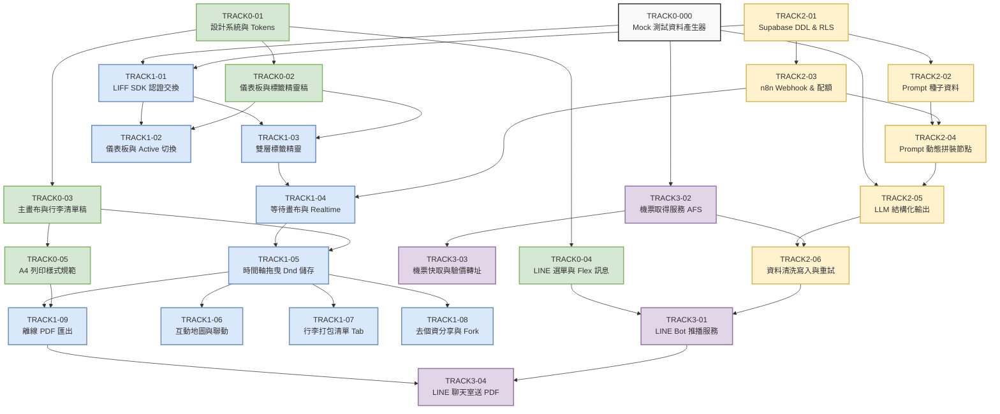

# Atrip 專案開發工單與 7 人分工總覽 (Task Breakdown & Team Roadmap)

* **專案名稱**：Atrip（你的 AI 自由行規劃夥伴）
* **版本**：v2.0.0
* **團隊規模**：7 人（跨 4 個功能軌道）
* **工單總數**：25 張獨立工單（包含 1 張基石任務與 24 張軌道功能工單）
* 🚀 **每日推進排程與開工清單**：請參閱 **[tickets/7人工作排程清單.md](7人工作排程清單.md)**（依日期與階段排序，同一階段平行工作一目瞭然）。
* 📁 **非工程團隊雲端分工與收件 SOP**：請參閱 **[tickets/非工程團隊分工與雲端交件指南.md](非工程團隊分工與雲端交件指南.md)**（防 Git 衝突、雲端目錄發包與 AI 提問咒語套版）。

---

## 1. 團隊架構與 7 人分工總覽表 (Team Allocation)

| 軌道代號 | 軌道名稱 | 編制人數 | 角色與成員配置 | 核心工作範疇 |
| :--- | :--- | :---: | :--- | :--- |
| **Track 0** | **視覺 UI/UX 設計組** | 2 人 | - **設計師 1 (系統規範與核心版面)**<br>- **設計師 2 (互動動效與通訊視覺)** | 品牌色彩系統、Tailwind Tokens、雙層標籤精靈、動態時間軸主畫布、LINE Rich Menu、Bubble Flex Message 與 A4 列印樣式。 |
| **Track 1** | **前端開發組 (LIFF Web App)** | 2 人 | - **前端工程師 A (核心畫布與狀態)**<br>- **前端工程師 B (精靈、地圖與分享)** | Next.js 14+ 專案架構、LIFF SDK 整合、儀表板、雙層標籤精靈、時間軸 Dnd 拖曳、Mapbox/Leaflet 地圖、行李清單與去個資分享/Fork。 |
| **Track 2** | **後端與 AI 邏輯組 (n8n & Supabase)** | 2 人 | - **後端工程師 A (資料庫架構與 LLM)**<br>- **後端工程師 B (n8n 工作流與管線)** | PostgreSQL 15+ Schema DDL、RLS 安全政策、`prompt_templates` 動態提示詞範本、n8n Webhook、每日 3 次防刷限流、LLM 結構化輸出與原子性入庫。 |
| **Track 3** | **LINE Bot & 數據 API/機票組** | 1 人 | - **後端/數據工程師 (API 與 Bot 專家)** | LINE Messaging API Webhook 接收與推播服務、機票資料取得服務 (AFS: Search Orchestrator, Adapters, 快取, 驗價, Deep Link) 與 PDF 渲染 Worker。 |

---

## 1.1 設計與邏輯完全解耦策略 (Decoupled Design & Logic Governance)

為了徹底避免「前端各自切版導致視覺碎片化、最後難以整合」的風險，全專案採取**「樣式與邏輯分離（Headless First）」**與**「Design Token 抽象注入」**之兩階段工程架構：

```mermaid
graph LR
    subgraph Track0_Design["Track 0: 設計組 (2人)"]
        D1[設計師 1: 品牌色票 & Tokens & 儀表板稿]
        D2[設計師 2: 畫布卡片 & LINE Flex & 動效]
    end

    subgraph Track1_Frontend["Track 1: 前端組 (2人)"]
        F_Logic[階段 1: 純邏輯開發 (Day 1~3)<br>LIFF Auth / Zustand Store / 拖曳演算法 / 800ms 防抖<br>★ 僅用無樣式骨架驗證資料，嚴禁手寫客製顏色]
        F_Skin[階段 2: 視覺套版注入 (Day 4 起)<br>匯入 tailwind.config.js<br>使用 bg-brand-primary、rounded-pill 等語意標籤]
    end

    D1 -->|交付 tailwind.config.js Tokens| F_Skin
    D2 -->|交付 Figma Wireframe 切版標註| F_Skin
    F_Logic --> F_Skin
```

### 核心防散架三不原則 (Anti-Fragmentation Rules)
1. **嚴禁手寫硬編碼色碼**：前端程式碼中**禁止出現** `#347FA3` 或 `bg-[#347FA3]` 等死板字串，所有外觀一律只能呼叫語意化 Token（如 `bg-brand-primary`、`text-brand-secondary`、`bg-brand-accent`）。
2. **邏輯先發，不卡設計**：前端工程師在 Day 1 ~ 3 專注於 **無頭邏輯 (Headless Logic)**：接通 LIFF SDK 登入、建立 Zustand 資料流、撰寫景點陣列拖曳交換邏輯、實作樂觀鎖版本控制。這些工作 100% 不依賴最終視覺稿。
3. **單點修改，全站同步**：設計師後續即使在 Figma 調整色號或按鈕圓角半徑，前端只需在 `tailwind.config.js` 修改一行代碼，全站數百處元件自動即時同步，**整合與重構成本趨近於零**。

---

## 1.2 設計組詳細工單分工表 (Track 0 UI/UX Breakdown)

設計組 2 位設計師有明確的權責切分，避免工作重疊：

| 設計成員 | 負責工單代號與名稱 | 交付時間節點 | 核心責任與交付產出 (Deliverables) |
| :--- | :--- | :---: | :--- |
| **設計師 1**<br>*(系統與流程主導)* | **[TRACK0-01](TRACK0-01-design-system-and-tokens.md)**<br>品牌設計系統與 Tailwind Tokens | **Day 2 (中午)**<br>*(最優先交付)* | 1. Atrip 品牌色票定義（主色旅行藍、次色鼠尾草綠、強調暖日橘）。<br>2. Figma Master Tokens 函式庫（顏色、字級、陰影）。<br>3. 交付 `tailwind.config.js` 擴充色階代碼給前端工程師。 |
| **設計師 1**<br>*(系統與流程主導)* | **[TRACK0-02](TRACK0-02-wireframe-dashboard-and-chip-wizard.md)**<br>儀表板與雙層標籤精靈稿 | **Day 3 (傍晚)** | 1. 「我的行程儀表板」卡片流、活躍/封存分頁、狀態選單 Figma 稿。<br>2. 「雙層標籤精靈」高保真設計：頂部橫向一鍵懶人套版（預設已高亮）＋ 下方自選按鈕矩陣。 |
| **設計師 1**<br>*(系統與流程主導)* | **[TRACK0-05](TRACK0-05-print-and-pdf-export-layout.md)**<br>A4 離線 PDF 與列印樣式規範 | **Day 5** | 1. A4 直式列印版面 Layout（包含頁首品牌、每日排程、交通與頁碼）。<br>2. 制定 `@media print` 規範（隱藏網頁按鈕、設定分頁防截斷屬性）。 |
| **設計師 2**<br>*(互動與通訊主導)* | **[TRACK0-03](TRACK0-03-wireframe-itinerary-canvas-and-packing.md)**<br>動態行程主畫布與行李清單稿 | **Day 3 (傍晚)** | 1. 每日時間軸活動卡片、交通轉乘提示膠囊視覺層級規範。<br>2. 卡片拖曳中（Drag State）陰影與放置藍線指示動效。<br>3. 「行李清單 (Packing List)」分頁分類佈局與 Checkbox 互動狀態。 |
| **設計師 2**<br>*(互動與通訊主導)* | **[TRACK0-04](TRACK0-04-line-richmenu-and-flex-message-design.md)**<br>LINE 選單與 Flex Message 設計 | **Day 4** | 1. LINE 官方帳號 Rich Menu 圖文選單圖片（2500x843）與點擊座標配置。<br>2. LINE Bubble Flex Message 完成推播氣泡卡片 JSON 範本（符合 LINE 模擬器標準）。 |

---

## 1.3 開工前確認守則與執行者問詢機制 (Pre-Execution Sign-off Protocol)

> ⚠️ **全員必讀・強制執行守則**：  
> 為了落實「責任明確、無縫拼裝」之工程目標，**任何執行者（包含人類工程師或自動化 AI 代理人）在開始動工任何一張工單前，必須在工單頂部的「開工前確認檢查清單」進行自檢簽核**。

### 開工前 4 大問詢檢核門檻 (The 4 Pre-flight Questions)
在開啟編輯器寫第一行程式碼或繪製設計稿前，請對自己或指派者重複問詢以下 4 個問題：
1. **「我的前置實體產出真的已經交付入庫了嗎？」**  
   * 不是只看依賴的工單編號，而是要親眼確認該工單交付的**具體實體檔案、資料表或設定檔**是否已經就緒（例如：`mock_itinerary.json` 是否存在、Supabase 表是否已部署、Figma Token 是否已給出）。
2. **「我是否已經閱讀過本任務相關的契約與規格書？」**  
   * 前端需閱讀 [Final SPEC/03-行程與偏好-JSON-Schema規格書.md](../Final%20SPEC/03-行程與偏好-JSON-Schema規格書.md) 與 [Final SPEC/DATA_STRUCTURES.md](../Final%20SPEC/DATA_STRUCTURES.md)。
   * 後端需確認 SQL DDL 與 RLS 政策邊界。
3. **「我是否清楚本工單的『紅線與禁止事項』？」**  
   * 前端：階段 1 嚴禁在程式碼中寫死 hex 色碼或自創非 Token 樣式。
   * 後端/中台：`service_role` 嚴禁進入瀏覽器；機票嚴禁對消費者網站執行 DOM 爬蟲。
4. **「本任務完成後，我能單獨 Demo 或通過驗收測試嗎？」**  
   * 每個 Ticket 都是獨立的切片，必須能依照「驗收條件 (Acceptance Criteria)」獨立驗證。

---

## 2. 開工優先順序與依賴關係圖 (Dependency Graph)

> 📄 **可編輯 Draw.io 依賴關係圖檔**：[tickets/dependency-graph.drawio](dependency-graph.drawio)



---

## 3. 全工單清單與交付物對照表 (Master Ticket Registry)

| 工單編號 | 工單名稱與檔案連結 | 負責軌道 | 工單性質 | 優先級 | 前置依賴 (Blocked by) | 開工硬性前置產出 (Strict Prerequisites) | 核心交付成果 |
| :--- | :--- | :---: | :---: | :---: | :--- | :--- | :--- |
| **TRACK0-000** | [TRACK0-000-mock-data-generator.md](TRACK0-000-mock-data-generator.md) | 基石任務 | **[數據合約]** | **P0** | None (立即開工) | [03-JSON-Schema規格書.md](../Final%20SPEC/03-行程與偏好-JSON-Schema規格書.md) | 產出 `mock_itinerary.json` 與 `mock_user_prefs.json` 供前後端平行開發。 |
| **TRACK0-01** | [TRACK0-01-design-system-and-tokens.md](TRACK0-01-design-system-and-tokens.md) | Track 0 (設1) | **[純設計交付]** | **P1** | None (立即開工) | Atrip 品牌核心簡報色票定義 | 品牌色（藍/綠/橘）、Typography、按鈕膠囊與 Tailwind Config。 |
| **TRACK0-02** | [TRACK0-02-wireframe-dashboard-and-chip-wizard.md](TRACK0-02-wireframe-dashboard-and-chip-wizard.md) | Track 0 (設1) | **[純設計交付]** | **P1** | `TRACK0-01` | `TRACK0-01` 交付之 Figma Master Tokens & 色階 | 儀表板與雙層標籤精靈（懶人套版預選點亮）之高保真 Figma 設計稿。 |
| **TRACK0-03** | [TRACK0-03-wireframe-itinerary-canvas-and-packing.md](TRACK0-03-wireframe-itinerary-canvas-and-packing.md) | Track 0 (設2) | **[純設計交付]** | **P1** | `TRACK0-01` | `TRACK0-01` 交付之 Figma Master Tokens | 時間軸活動卡片、交通轉乘膠囊、地圖 FlyTo 與行李清單 Wireframe。 |
| **TRACK0-04** | [TRACK0-04-line-richmenu-and-flex-message-design.md](TRACK0-04-line-richmenu-and-flex-message-design.md) | Track 0 (設2) | **[純設計交付]** | **P2** | `TRACK0-01` | `TRACK0-01` 交付之品牌色票規範 | LINE Rich Menu 圖片與 Bubble Flex Message 完成推播 JSON 範本。 |
| **TRACK0-05** | [TRACK0-05-print-and-pdf-export-layout.md](TRACK0-05-print-and-pdf-export-layout.md) | Track 0 (設1) | **[純設計交付]** | **P2** | `TRACK0-03` | `TRACK0-03` 交付之主畫布時間軸視覺排版 | A4 直式離線 PDF 樣式規範與 `@media print` 防斷行 CSS 規則。 |
| **TRACK1-01** | [TRACK1-01-liff-sdk-and-auth-exchange.md](TRACK1-01-liff-sdk-and-auth-exchange.md) | Track 1 (前A) | **[純邏輯先發]** | **P0** | `TRACK0-000`, `TRACK2-01` | `TRACK0-000` Mock 資料、Supabase 專案 URL & Anon Key | LIFF SDK 初始化、LINE ID Token 交換 Supabase JWT 與會話維持。 |
| **TRACK1-02** | [TRACK1-02-dashboard-and-active-trip-manager.md](TRACK1-02-dashboard-and-active-trip-manager.md) | Track 1 (前A) | **[邏輯+套版]** | **P1** | `TRACK1-01`, `TRACK0-02` | `TRACK1-01` 登入會話、`TRACK0-02` 儀表板 Wireframe 稿 | 我的行程儀表板：活躍列表、歷史封存、★ 關注切換與軟刪除。 |
| **TRACK1-03** | [TRACK1-03-dual-layer-chip-wizard.md](TRACK1-03-dual-layer-chip-wizard.md) | Track 1 (前B) | **[邏輯+套版]** | **P0** | `TRACK1-01`, `TRACK0-02` | `TRACK1-01` 登入環境、`TRACK0-02` 雙層標籤精靈 Wireframe | 雙層標籤精靈：第 1 層一鍵懶人套版（0 點擊發動）＋ 第 2 層自選矩陣。 |
| **TRACK1-04** | [TRACK1-04-realtime-waiting-screen.md](TRACK1-04-realtime-waiting-screen.md) | Track 1 (前B) | **[純邏輯先發]** | **P1** | `TRACK1-03`, `TRACK2-03` | `TRACK1-03` 送出行為、Supabase Realtime 連線通道 | 等待畫布：動畫、Tips 輪播、Supabase Realtime 監聽 completed 自動切換。 |
| **TRACK1-05** | [TRACK1-05-timeline-dnd-and-optimistic-save.md](TRACK1-05-timeline-dnd-and-optimistic-save.md) | Track 1 (前A) | **[邏輯+套版]** | **P0** | `TRACK0-000`, `TRACK1-04`, `TRACK0-03` | `mock_itinerary.json`、`TRACK0-03` 卡片與拖曳陰影視覺稿 | 時間軸主畫布：景點卡片渲染、Dnd 拖曳、800ms 防抖更新與樂觀鎖。 |
| **TRACK1-06** | [TRACK1-06-interactive-map-and-sync.md](TRACK1-06-interactive-map-and-sync.md) | Track 1 (前B) | **[純邏輯先發]** | **P2** | `TRACK1-05` | `TRACK1-05` 時間軸資料、Mapbox/Leaflet 套件金鑰 | Mapbox/Leaflet 整合：依天數標記坐標，卡片點擊平滑移動 (FlyTo)。 |
| **TRACK1-07** | [TRACK1-07-packing-list-interactive-tab.md](TRACK1-07-packing-list-interactive-tab.md) | Track 1 (前A) | **[邏輯+套版]** | **P2** | `TRACK1-05` | `TRACK1-05` 主畫布結構、`mock_itinerary.json` 打包清單 | 智能行李打包清單 Tab：分類展示，支援 Checkbox 打勾並寫入 JSONB。 |
| **TRACK1-08** | [TRACK1-08-deidentified-share-and-fork.md](TRACK1-08-deidentified-share-and-fork.md) | Track 1 (前B) | **[純邏輯先發]** | **P1** | `TRACK1-05`, `TRACK2-01` | `TRACK1-05` 行程資料、Supabase 匿名查詢公開權限 | 外連分享頁面（去個資唯讀）與一鍵「複製到我的行程 (Fork)」交易。 |
| **TRACK1-09** | [TRACK1-09-offline-pdf-export.md](TRACK1-09-offline-pdf-export.md) | Track 1 (前A) | **[邏輯+套版]** | **P2** | `TRACK1-05`, `TRACK0-05`, `TRACK3-04` | `TRACK1-05` 頁面、`TRACK0-05` 列印 CSS、`TRACK3-04` 後端端點 | 離線 PDF 匯出：一般瀏覽器原生列印 ＋ LINE 內建環境觸發推送。 |
| **TRACK2-01** | [TRACK2-01-supabase-ddl-and-rls-setup.md](TRACK2-01-supabase-ddl-and-rls-setup.md) | Track 2 (後A) | **[純後端先發]** | **P0** | None (立即開工) | Supabase 專案環境、[02-資料庫設計與SQL-DDL.md](../Final%20SPEC/02-資料庫設計與SQL-DDL.md) | 部署 6 大資料表 DDL、外鍵約束、GIN 索引與生產級 RLS 權限。 |
| **TRACK2-02** | [TRACK2-02-prompt-templates-seed-and-hot-update.md](TRACK2-02-prompt-templates-seed-and-hot-update.md) | Track 2 (後A) | **[純後端先發]** | **P1** | `TRACK2-01` | `TRACK2-01` 已建立之 `prompt_templates` 資料表 | 灌入 `prompt_templates` 種子資料（連住基地、換宿行李、捷運代碼、賽事錨點）。 |
| **TRACK2-03** | [TRACK2-03-n8n-webhook-and-quota-guard.md](TRACK2-03-n8n-webhook-and-quota-guard.md) | Track 2 (後B) | **[純中台先發]** | **P0** | `TRACK2-01` | `TRACK2-01` 已建立之 `itinerary_jobs` 表、n8n 執行環境 | n8n Webhook Ingress (Secret 驗證) 與用戶每日 3 次、活躍<=5 限額檢查。 |
| **TRACK2-04** | [TRACK2-04-dynamic-prompt-assembler-node.md](TRACK2-04-dynamic-prompt-assembler-node.md) | Track 2 (後B) | **[純中台先發]** | **P1** | `TRACK2-02`, `TRACK2-03` | `TRACK2-02` 提示詞種子資料、`TRACK2-03` Webhook 節點 | n8n 查詢 `prompt_templates` 依照用戶選項與優先權動態拼裝 Master Prompt。 |
| **TRACK2-05** | [TRACK2-05-llm-structured-output-orchestration.md](TRACK2-05-llm-structured-output-orchestration.md) | Track 2 (後A) | **[純AI先發]** | **P0** | `TRACK0-000`, `TRACK2-04` | `atrip_itinerary_schema`、OpenAI API Key、`TRACK2-04` 拼裝提示詞 | OpenAI gpt-4o 整合：強制 JSON Schema 輸出行程與行李打包清單。 |
| **TRACK2-06** | [TRACK2-06-n8n-data-persistence-and-retry.md](TRACK2-06-n8n-data-persistence-and-retry.md) | Track 2 (後B) | **[純中台先發]** | **P0** | `TRACK2-05`, `TRACK3-02` | `TRACK2-05` LLM 輸出、`TRACK3-02` 機票資料、Supabase 寫入金鑰 | n8n 資料清洗、注入活動唯一 ID、原子性寫入 DB 與全域錯誤 Catch。 |
| **TRACK3-01** | [TRACK3-01-line-bot-webhook-and-push-service.md](TRACK3-01-line-bot-webhook-and-push-service.md) | Track 3 (數1) | **[純Bot先發]** | **P1** | `TRACK0-04` | LINE Messaging API Channel Secret、`TRACK0-04` 的 Flex 卡片 JSON | LINE Messaging API Webhook 接收、Active 上下文回覆與 Flex 推播。 |
| **TRACK3-02** | [TRACK3-02-flight-acquisition-service-orchestrator.md](TRACK3-02-flight-acquisition-service-orchestrator.md) | Track 3 (數1) | **[純API先發]** | **P0** | `TRACK0-000` | `mock_itinerary.json` 的航班結構、Amadeus / Skyscanner 測試 Key | 機票服務 AFS：IATA 解析、調度器、Amadeus/Skyscanner 適配與加權評分。 |
| **TRACK3-03** | [TRACK3-03-flight-cache-price-refresh-and-deeplink.md](TRACK3-03-flight-cache-price-refresh-and-deeplink.md) | Track 3 (數1) | **[純API先發]** | **P1** | `TRACK3-02` | `TRACK3-02` 機票搜尋端點、Redis / 記憶體快取連線實例 | AFS 20 分鐘短期快取、驗價可用性檢查、聯盟 Deep Link 轉址與熔斷器。 |
| **TRACK3-04** | [TRACK3-04-line-bot-pdf-delivery-worker.md](TRACK3-04-line-bot-pdf-delivery-worker.md) | Track 3 (數1) | **[純Worker先發]** | **P2** | `TRACK3-01`, `TRACK1-09` | `TRACK3-01` LINE Bot 發送服務、Puppeteer 環境、`TRACK1-09` 列印頁面 | 後端 Puppeteer 渲染 A4 PDF 上傳 Storage，LINE Bot 檔案推播至對話框。 |

---

## 4. 各軌道交付里程碑 (Milestones)

### 🚩 Milestone 1: 基礎設施與契約就緒 (Day 1 ~ 3)
* **交付標準**：
  * `TRACK0-000` 產出 `mock_itinerary.json` 與 `mock_user_prefs.json`。
  * `TRACK0-01` 產出 Tailwind Tokens。
  * `TRACK2-01` 完成 Supabase DDL 與 RLS 部署。
  * 前端與後端依據 Mock 資料展開本地開發。

### 🚩 Milestone 2: 進站閉環與核心生成管線 (Day 4 ~ 10)
* **交付標準**：
  * `TRACK1-01`、`TRACK1-02`、`TRACK1-03` 完成 LIFF 免密登入、儀表板與雙層標籤精靈。
  * `TRACK2-03`、`TRACK2-04`、`TRACK2-05`、`TRACK3-02` 完成 n8n、動態 Prompt 組裝、OpenAI 結構化輸出與機票服務。
  * 點擊「一鍵開始 AI 規劃」後，資料能在 25 秒內順利入庫。

### 🚩 Milestone 3: 畫布互動與雙軌通知 (Day 11 ~ 16)
* **交付標準**：
  * `TRACK1-04`、`TRACK1-05`、`TRACK1-06`、`TRACK1-07` 完成等待畫布、時間軸拖曳 Dnd、地圖平滑移動與行李清單。
  * `TRACK3-01`、`TRACK2-06` 完成行程就緒 LINE Bubble Flex Message 推播。
  * 使用者可完整體驗「標籤送出 $\rightarrow$ 等待 $\rightarrow$ 即時載入畫布 $\rightarrow$ 拖曳調整自動儲存」。

### 🚩 Milestone 4: 社群擴散、PDF 與全路徑硬化 (Day 17 ~ 21)
* **交付標準**：
  * `TRACK1-08` 完成去識別化外連分享與一鍵 Fork 交易。
  * `TRACK1-09`、`TRACK3-04` 完成瀏覽器列印與 LINE 聊天室實體 PDF 推送。
  * `TRACK3-03` 機票快取與驗價 Deep Link 轉址生效。
  * 通過 5 大高階測試縫線驗收，正式部署上線。
